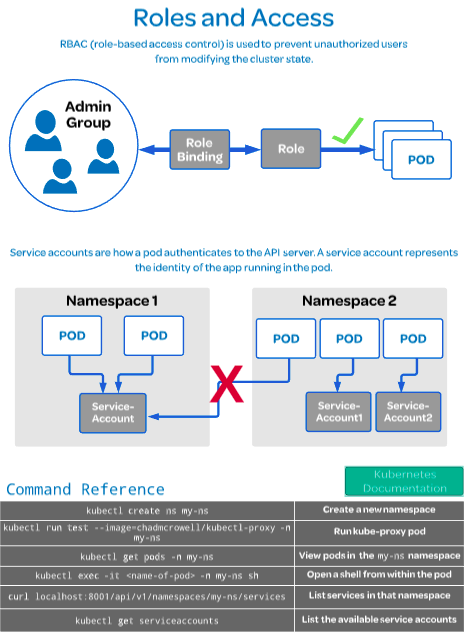

# CKA

### Exam Details

The online exam consists of a set of performance-based items (problems) to be solved in a command line and candidates have 3 hours to complete the tasks.

The Certification focuses on the skills required to be a successful Kubernetes Administrator in industry today. This includes these general domains and their weights on the exam:

- Core Concepts - 19%
  - Understand the Kubernetes API primitives.
  - Understand the Kubernetes cluster architecture.
  - Understand Services and other network primitives.

- Installation, Configuration & Validation - 12%
  - Design a Kubernetes cluster.
  - Install Kubernetes masters and nodes.
  - Configure secure cluster communications.
  - Configure a Highly-Available Kubernetes cluster.
  - Know where to get the Kubernetes release binaries.
  - Provision underlying infrastructure to deploy a Kubernetes cluster.
  - Choose a network solution.
  - Choose your Kubernetes infrastructure configuration.
  - Run end-to-end tests on your cluster.
  - Analyse end-to-end tests results.
  - Run Node end-to-end tests.
  - Install and use kubeadm to install, confi gure, and manage Kubernetes clusters

- Security - 12%
  - Know how to configure authentication and authorization.
  - Understand Kubernetes security primitives.
  - Know to configure network policies.
  - Create and manage TLS certificates for cluster components.
  - Work with images securely.
  - Define security contexts.
  - Secure persistent key value store.

- Networking - 11%
  - Understand the networking configuration on the cluster nodes.
  - Understand Pod networking concepts.
  - Understand service networking.
  - Deploy and configure network load balancer.
  - Know how to use Ingress rules.
  - Know how to configure and use the cluster DNS.
  - Understand CNI.

- Cluster Maintenance - 11%
  - Understand Kubernetes cluster upgrade process.
  - Facilitate operating system upgrades.
  - Implement backup and restore methodologies

- Troubleshooting - 10%
  - Troubleshoot application failure.
  - Troubleshoot control plane failure.
  - Troubleshoot worker node failure.
  - Troubleshoot networking.

- Application Lifecycle Management-  8%
  - Understand Deployments and how to per form rolling updates and rollbacks.
  - Know various ways to configure applications.
  - Know how to scale applications.
  - Understand the primitives necessary to create a self-healing application.

- Storage - 7%
  - Understand persistent volumes and know how to create them.
  - Understand access modes for volumes.
  - Understand persistent volume claims primitive.
  - Understand Kubernetes storage objects.
  - Know how to configure applications with persistent storage.

- Scheduling-  5%
  - Use label selectors to schedule Pods.
  - Understand the role of DaemonSets.
  - Understand how resource limits can affect Pod scheduling.
  - Understand how to run multiple schedulers and how to configure Pods to use them.
  - Manually schedule a pod without a scheduler.
  - Display scheduler events.
  - Know how to configure the Kubernetes scheduler.

- Logging / Monitoring-  5%
  - Understand how to monitor all cluster components.
  - Understand how to monitor applications.
  - Manage cluster component logs.
  - Manage application logs.

### Exam Resources

- [Candidate Handbook](https://training.linuxfoundation.org/wp-content/uploads/2020/01/CKA-CKAD-Candidate-Handbook-v1.8.pdf)
- [Curriculum Overview](https://github.com/cncf/curriculum)
- [Exam Tips](https://training.linuxfoundation.org/wp-content/uploads/2020/01/Important-Tips-CKA-CKAD-01.28.2020.pdf)
- [Frequently Asked Questions](https://training.linuxfoundation.org/wp-content/uploads/2020/01/CKA-CKAD-FAQ-01.28.2020.pdf)
- [Certification and Confidentiality Agreement](https://training.linuxfoundation.org/wp-content/uploads/2020/01/Certification-and-Confidentiality-Agreement-CNCF-v1.3-1.pdf)
- [Verify Certification](https://training.linuxfoundation.org/certification/verify/)

---

# 1 - Core Concepts

## Understand the Kubernetes cluster architecture.

### Control Plane Components


**[kube Api Server](https://kubernetes.io/docs/reference/command-line-tools-reference/kube-apiserver/)** The Kubernetes API server validates and configures data for the api objects which include pods, services, replicationcontrollers, and others. The API Server services REST operations and provides the frontend to the cluster’s shared state through which all other components interact.

The communication hub for all cluster components. It exposes the kubernetes API.

```
kube-apiserver [flags]
```

**[kube Schedule](https://kubernetes.io/docs/reference/command-line-tools-reference/kube-scheduler/)** The Kubernetes scheduler is a policy-rich, topology-aware, workload-specific function that significantly impacts availability, performance, and capacity. The scheduler needs to take into account individual and collective resource requirements, quality of service requirements, hardware/software/policy constraints, affinity and anti-affinity specifications, data locality, inter-workload interference, deadlines, and so on. Workload-specific requirements will be exposed through the API as necessary.

Assings your app to a worker node, auto-detects which pod to assign to which node based on resource requirements, hardware constraints, etc.

```
kube-scheduler [flags]
```

**[kube controller manager](https://kubernetes.io/docs/reference/command-line-tools-reference/kube-controller-manager/)** The Kubernetes controller manager is a daemon that embeds the core control loops shipped with Kubernetes. In applications of robotics and automation, a control loop is a non-terminating loop that regulates the state of the system. In Kubernetes, a controller is a control loop that watches the shared state of the cluster through the apiserver and makes changes attempting to move the current state towards the desired state. Examples of controllers that ship with Kubernetes today are the replication controller, endpoints controller, namespace controller, and serviceaccounts controller.

Maintains the cluster. handles node failure, replicating components, maintaning the correct amount of pods, etc.

```
kube-controller-manager [flags]
```

**[ETCD](https://etcd.io/docs/v3.4.0/)** Consistent and highly-available key value store used as Kubernetes’ backing store for all cluster data.

If your Kubernetes cluster uses etcd as its backing store, make sure you have a back up plan for those data.

Data store that stores the cluster configuration.

### Node Components

**[Kubelet](https://kubernetes.io/docs/concepts/overview/components/#kubelet)** Runs and manages the containers on the node and talks to the kube API server.

**[kube-proxy](https://kubernetes.io/docs/concepts/overview/components/#kube-proxy)** kube-proxy is a network proxy that runs on each node in your cluster, implementing part of the Kubernetes Service concept.

kube-proxy maintains network rules on nodes. These network rules allow network communication to your Pods from network sessions inside or outside of your cluster.

kube-proxy uses the operating system packet filtering layer if there is one and it’s available. Otherwise, kube-proxy forwards the traffic itself.

Load balances traffic between application components.

**[Container runtime](https://kubernetes.io/docs/concepts/overview/components/#container-runtime)** The container runtime is the software that is responsible for running containers.

Kubernetes supports several container runtimes: Docker, containerd, CRI-O, and any implementation of the Kubernetes CRI (Container Runtime Interface).


```
kubectl get componentstatuses
```

---

## Understand the Kubernetes API primitives.

Every component in the Kubernetes system makes a request to the API server. The kubectl command line utility processes those API calls for us and allows us to format our request in a certain way. In this lesson, we will learn how Kubernetes accepts the instructions to run deployments and go through the YAML script that is used to tell the control plane what our environment should look like.


**[apiVersion](https://kubernetes.io/docs/concepts/overview/working-with-objects/kubernetes-objects/#required-fields)** Kubernetes API version, which indicates the path to ensure the api presents a clear, consistent view of system resources and behavior, follow the example below.

```
apiVersion: apps/v1
```

**kind** Presents kind of objetc you want to create This is a REQUIRED field. Examples of kinds of objects include `Pod`,`Deployment`,`Dob`,`DaemonSets`,`ReplicaSet`, `Replicationcontrollers` and more, follow the example below.

```
apiVersion: apps/v1
kind: Deployment
```

**metadata** Data that helps uniquely identify the objetc, including a `name` string `UID`, and optional namespace, for

**Tips about [name](https://kubernetes.io/docs/concepts/overview/working-with-objects/names/)**

> Only one object of a given kind can have a given name at a time. However, if you delete the object, you can make a new object with the same name.

> Kubernetes resources can have names up to **253 characters** long. The characters allowed in names are: `digits (0-9)`, `lower case letters (a-z)`, `-`, and `.`.

```
apiVersion: apps/v1
kind: Deployment
metadata:
  name: nginx-deployment
```

There are other importants thinks to know, it is useful in the metadata, `Labels` and `Annotations`.

**Labels**

`Labels` are key/value pairs that are attached to objects, such as pods. `Labels` are intended to be used to specify identifying attributes of objects that are meaningful and relevant to users, but do not directly imply semantics to the core system. `Labels` can be used to organize and to select subsets of objects. `Labels` can be attached to objects at creation time and subsequently added and modified at any time. Each object can have a set of key/value labels defined. Each Key must be unique for a given object.

```
"metadata": {
  "labels": {
    "key1" : "value1",
    "key2" : "value2"
  }
}
```

**Tips** Before you create any object you can use the `Selectors` to filter them, show the especific label, all or many labels, follow the exemples below.

All

```
kubectl get <object> --show-labels

kubectl get pods|pod --show-labels
```

All labels with `app`

```
kubectl get pods -L app
```

Specific label key and value

```
kubectl get pods -l app=nginx
```

**Annotations** You can use either labels or annotations to attach metadata to Kubernetes objects. Labels can be used to select objects and to find collections of objects that satisfy certain conditions. In contrast, annotations are not used to identify and select objects. The metadata in an annotation can be small or large, structured or unstructured, and can include characters not permitted by labels.

Annotations, like labels, are key/value maps:

```
"metadata": {
  "annotations": {
    "key1" : "value1",
    "key2" : "value2"
  }
}
```

Here are some examples of information that could be recorded in annotations:

- Fields managed by a declarative configuration layer. Attaching these fields as annotations distinguishes them from default values set by clients or servers, and from auto-generated fields and fields set by auto-sizing or auto-scaling systems.
- Build, release, or image information like timestamps, release IDs, git branch, PR numbers, image hashes, and registry address.
- Pointers to logging, monitoring, analytics, or audit repositories.
- Client library or tool information that can be used for debugging purposes: for example, name, version, and build information.
- User or tool/system provenance information, such as URLs of related objects from other ecosystem components.
- Lightweight rollout tool metadata: for example, config or checkpoints.
- Phone or pager numbers of persons responsible, or directory entries that specify where that information can be found, such as a team web site.
- Directives from the end-user to the implementations to modify behavior or engage non-standard features.


**[DeploymentSpec v1 apps](https://kubernetes.io/docs/reference/generated/kubernetes-api/v1.13/#deploymentspec-v1-apps)** Describe your desired state for the object and the characteristics you want the objetct to have. The format of the object spec is different for every object and contains nested fields specific to that object.

```
apiVersion: apps/v1
kind: Deployment
metadata:
  name: nginx-deployment
spec:
  selector:
    matchLabels:
      app: nginx
  replicas: 2
  template:
    metadata:
      labels:
        app: nginx
```

**[Container Spec](https://kubernetes.io/docs/concepts/containers/container-environment-variables/)** Specifies the pod's container image, volumes, and exposed ports for the container.

```
apiVersion: apps/v1
kind: Deployment
metadata:
  name: nginx-deployment
spec:
  selector:
    matchLabels:
      app: nginx
  replicas: 2
  template:
    metadata:
      labels:
        app: nginx
    spec:
      containers:
      - name: nginx
        image: nginx:1.7.9
        ports:
        - containerPort: 80
```

**[Field selctor](https://kubernetes.io/docs/concepts/overview/working-with-objects/field-selectors/)** Field selectors let you select Kubernetes resources based on the value of one or more resource fields. Here are some examples of field selector queries:

```
metadata.name=my-service

metadata.namespace!=default

status.phase=Pending
```

**[Tips selector](https://kubernetes.io/docs/concepts/workloads/pods/pod-lifecycle/#pod-phase)** follow some field selectors to make easy your querys

**[Pod phase](https://kubernetes.io/docs/concepts/workloads/pods/pod-lifecycle/#pod-phase)**

```
kubectl get pods --field-selector status.phase==<Status>
```

Status Value | Description
:---:|:---:
Pending | The Pod has been accepted by the Kubernetes system, but one or more of the Container images has not been created. This includes time before being scheduled as well as time spent downloading images over the network, which could take a while.
Running | The Pod has been bound to a node, and all of the Containers have been created. At least one Container is still running, or is in the process of starting or restarting.
Succeeded | All Containers in the Pod have terminated in success, and will not be restarted.
Failed | All Containers in the Pod have terminated, and at least one Container has terminated in failure. That is, the Container either exited with non-zero status or was terminated by the system.
Unknown | For some reason the state of the Pod could not be obtained, typically due to an error in communicating with the host of the Pod.

You can use some conditions as `!=`, `==` or `=`

```
kubectl get pods --field-selector status.phase==Running

kubectl get pods --field-selector metadata.namespace!=default

kubectl get pods --field-selector metadata.namespace==default,status.phase==Running
```
---

## Understand Services and other network primitives.

**[Services](https://kubernetes.io/docs/concepts/services-networking/service/)** An abstract way to expose an application running on a set of Pods as a network service.

With Kubernetes you don’t need to modify your application to use an unfamiliar service discovery mechanism. Kubernetes gives Pods their own IP addresses and a single DNS name for a set of Pods, and can load-balance across them.


```
apiVersion: apps/v1
kind: Deployment
metadata:
  annotations:
    deployment.kubernetes.io/revision: "1"
  name: nginx-deployment
spec:
  replicas: 2
  selector:
    matchLabels:
      app: nginx
  strategy:
    rollingUpdate:
      maxSurge: 25%
      maxUnavailable: 25%
    type: RollingUpdate
  template:
    metadata:
      creationTimestamp: null
      labels:
        app: nginx
    spec:
      containers:
      - image: nginx:1.7.9
        imagePullPolicy: IfNotPresent
        name: nginx
        ports:
        - containerPort: 80
          protocol: TCP
```

```
apiVersion: v1
kind: Service
metadata:
  name: nginx-nodeport
spec:
  type: NodePort
  ports:
  - protocol: TCP
    port: 80
    targetPort: 80
    nodePort: 30080
  selector:
    app: nginx
```

```
cat << EOF | kubectl create -f -
apiVersion: v1
kind: Pod
metadata:
  name: busybox
spec:
  containers:
  - name: busybox
    image: radial/busyboxplus:curl
    args:
    - sleep
    - "1000"
EOF
```

**[DNS for Services and Pods](https://kubernetes.io/docs/concepts/services-networking/dns-pod-service/)** Kubernetes DNS schedules a DNS Pod and Service on the cluster, and configures the kubelets to tell individual containers to use the DNS Service’s IP to resolve DNS names.

**[A/AAAA records](https://kubernetes.io/docs/concepts/services-networking/dns-pod-service/#a-aaaa-records)** “Normal” (not headless) Services are assigned a DNS A or AAAA record, depending on the IP family of the service, for a name of the form `my-svc.my-namespace.svc.cluster-domain.example`. This resolves to the cluster IP of the Service.

“Headless” (without a cluster IP) Services are also assigned a DNS A or AAAA record, depending on the IP family of the service, for a name of the form `my-svc.my-namespace.svc.cluster-domain.example`. Unlike normal Services, this resolves to the set of IPs of the pods selected by the Service. Clients are expected to consume the set or else use standard `round-robin` selection from the set.

**[SRV records](https://kubernetes.io/docs/concepts/services-networking/dns-pod-service/#srv-records)** SRV Records are created for named ports that are part of normal or Headless Services. For each named port, the SRV record would have the form `_my-port-name._my-port-protocol.my-svc.my-namespace.svc.cluster-domain.example`. For a regular service, this resolves to the port number and the domain name: `my-svc.my-namespace.svc.cluster-domain.example`. For a headless service, this resolves to multiple answers, one for each pod that is backing the service, and contains the port number and the domain name of the pod of the form `auto-generated-name.my-svc.my-namespace.svc.cluster-domain.example`.

---

## Installation, Configuration & Validation - 12%

### Basic cluster

#### On all nodes
Install docker

```
curl -fsSL https://download.docker.com/linux/ubuntu/gpg | sudo apt-key add -
sudo add-apt-repository    "deb [arch=amd64] https://download.docker.com/linux/ubuntu \
   $(lsb_release -cs) \
   stable"
```

kubernetes components
```
curl -s https://packages.cloud.google.com/apt/doc/apt-key.gpg | sudo apt-key add -

cat << EOF | sudo tee /etc/apt/sources.list.d/kubernetes.list
deb https://apt.kubernetes.io/ kubernetes-xenial main
EOF

```

Install Docker, kubelet, kubeadm, and kubectl:

```
sudo apt-get update && \
sudo apt-get install -y docker-ce=18.06.1~ce~3-0~ubuntu kubelet=1.15.7-00 kubeadm=1.15.7-00 kubectl=1.15.7-00
```

Hold them at the current version:
```
sudo apt-mark hold docker-ce kubelet kubeadm kubectl
```

Add the iptables rule to sysctl.conf and enable
```
echo "net.bridge.bridge-nf-call-iptables=1" | sudo tee -a /etc/sysctl.conf
sudo sysctl -p
```


#### Only master node

```
kubeadm config images pull
kubeadm init --pod-network-cidr=<IP>/<mask>
```

Set up local kubeconfig:

```
mkdir -p $HOME/.kube
sudo cp -i /etc/kubernetes/admin.conf $HOME/.kube/config
sudo chown $(id -u):$(id -g) $HOME/.kube/config
```

Apply Flannel CNI network overlay:

```
kubectl apply -f https://raw.githubusercontent.com/coreos/flannel/master/Documentation/kube-flannel.yml
```

#### Only wokers

Join the worker nodes to the cluster:

```
sudo kubeadm join <token>
```

#### Validation

```
kubectl get nodes
```

## Building a Highly Available Kubernetes Cluster


I maked a lab with this kind of cluster to,[more information](cluster_mult_master/README.md)

To see all components in each node.

```
kubectl get pods -o custom-columns=POD:metadata.name,NODE:spec.nodeName --sort-by spec.nodeName -n kube-system
```

## Configuring Secure Cluster Communications

To prevent unauthorized users from modifying the cluster state, RBAC is used, defining roles and role bindings for a user. A service account resource is created for a pod to determine how it has control over the cluster state. For example, the default service account will not allow you to list the services in a namespace.


In the documentation says, we as sysadmin, should use Transport Layer Security (TLS) for all API traffic, and should know each component to identify potentially unsecured traffic.

### API Authentication

Choose an authentication mechanism for the API servers to use that matches the common access patterns when you install a cluster. For instance, small single user clusters may wish to use a simple certificate or static Bearer token approach. Larger clusters may wish to integrate an existing OIDC or LDAP server that allow users to be subdivided into groups.

All API clients must be [authenticated](https://kubernetes.io/docs/reference/access-authn-authz/authentication/), even those that are part of the infrastructure like nodes, proxies, the scheduler, and volume plugins. These clients are typically service accounts or use x509 client certificates, and they are created automatically at cluster startup or are setup as part of the cluster installation.

### API Authorization

Once authenticated, every API call is also expected to pass an authorization check. Kubernetes ships an integrated Role-Based Access Control (RBAC) component that matches an incoming user or group to a set of permissions bundled into roles. These permissions combine verbs (get, create, delete) with resources (pods, services, nodes) and can be namespace or cluster scoped. A set of out of the box roles are provided that offer reasonable default separation of responsibility depending on what actions a client might want to perform. It is recommended that you use the Node and RBAC authorizers together, in combination with the NodeRestriction admission plugin.

As with authentication, simple and broad roles may be appropriate for smaller clusters, but as more users interact with the cluster, it may become necessary to separate teams into separate namespaces with more limited roles.

With authorization, it is important to understand how updates on one object may cause actions in other places. For instance, a user may not be able to create pods directly, but allowing them to create a deployment, which creates pods on their behalf, will let them create those pods indirectly. Likewise, deleting a node from the API will result in the pods scheduled to that node being terminated and recreated on other nodes. The out of the box roles represent a balance between flexibility and the common use cases, but more limited roles should be carefully reviewed to prevent accidental escalation. You can make roles specific to your use case if the out-of-box ones don’t meet your needs.

### Controlling access to the Kubelet

Kubelets expose HTTPS endpoints which grant powerful control over the node and containers. By default Kubelets allow unauthenticated access to this API.

Production clusters should enable Kubelet [authentication](https://kubernetes.io/docs/reference/command-line-tools-reference/kubelet-authentication-authorization/) and authorization.


---




Create a new user and `config` file with certificate

```
openssl req -new -newkey rsa:4096 -nodes -keyout dev.key -out dev.csr -subj "/CN=dev/O=dev"
openssl x509 -req -in dev.csr -CA /etc/kubernetes/pki/ca.crt -CAkey /etc/kubernetes/pki/ca.key -CAcreateserial -out dev.crt -days 365
cp /etc/kubernetes/pki/ca.crt ./k8s.crt
```

```
cat <<EOF> dev-csr.yaml
apiVersion: certificates.k8s.io/v1beta1
kind: CertificateSigningRequest
metadata:
  name: dev-access
  namespace: <namespace>
spec:
  groups:
  - system:authenticated
  request: $(cat dev.csr | base64 | tr -d '\n')
  usages:
  - client authcertificatesigningrequest.certificates.k8s.io/dev-access created
EOF
```

```
kubectl -n <namespace> create -f dev-csr.yaml
kubectl -n <namespace> get csr
kubectl -n <namespace> certificate approve dev-access
kubectl -n <namespace> get csr
```

```
kubectl -n <namespace> config set-cluster $(kubectl config view -o jsonpath='{.clusters[0].name}') --server=$(kubectl config view -o jsonpath='{.clusters[0].cluster.server}') --certificate-authority=k8s.crt --kubeconfig=dev-config --embed-certs

kubectl -n <namespace> config set-credentials dev --client-certificate=dev.crt --client-key=dev.key --embed-certs --kubeconfig=dev-config

kubectl -n <namespace> config set-context dev --cluster=$(kubectl config view -o jsonpath='{.clusters[0].name}') --namespace=dev --user=dev --kubeconfig=dev-config
```

```
kubectl config use-context dev --kubeconfig=dev-config
kubectl version --kubeconfig=dev-config
kubectl -n <namespace> get pods --kubeconfig=dev-config
```


---
# References

- [What is kubernetes](https://kubernetes.io/docs/concepts/overview/what-is-kubernetes/)
- [12factor app](https://12factor.net/pt_br/)
- [Pod of minerva](https://interactive.linuxacademy.com/diagrams/ThePodofMinerva.html)
- [CKA](https://www.cncf.io/certification/cka/)
- [Kube-api](https://kubernetes.io/docs/reference/command-line-tools-reference/kube-apiserver/)
- [Kube schedule](https://kubernetes.io/docs/reference/command-line-tools-reference/kube-scheduler/)
- [Kube controller manager](https://kubernetes.io/docs/reference/command-line-tools-reference/kube-controller-manager/)
- [Etcd](https://kubernetes.io/docs/concepts/overview/components/#etcd)
- [Kubelet](https://kubernetes.io/docs/reference/command-line-tools-reference/kubelet/)
- [Kube-proxy](https://kubernetes.io/docs/reference/command-line-tools-reference/kube-proxy/)
- [Container runtime](https://kubernetes.io/docs/concepts/overview/components/#container-runtime)
- [Kubernetes components](https://kubernetes.io/docs/concepts/overview/components/)
- [Kubernetes field selector](https://kubernetes.io/docs/concepts/overview/working-with-objects/field-selectors/)
- [Services](https://kubernetes.io/docs/concepts/services-networking/service/)
- [Proxy](https://kubernetes.io/docs/concepts/services-networking/service/#virtual-ips-and-service-proxies)
- [High availability](https://kubernetes.io/docs/setup/production-environment/tools/kubeadm/high-availability/)
- [HA topology](https://kubernetes.io/docs/setup/production-environment/tools/kubeadm/ha-topology/)
- [Configure upgrade etcd](https://kubernetes.io/docs/tasks/administer-cluster/configure-upgrade-etcd/)
- [Kubernetes high-availability ](https://kubernetes.io/docs/setup/production-environment/tools/kubeadm/high-availability/)
- [HA topology](https://kubernetes.io/docs/setup/production-environment/tools/kubeadm/ha-topology/)
- [Configure upgrade etcd](https://kubernetes.io/docs/tasks/administer-cluster/configure-upgrade-etcd/)
- [Configuration services account](https://kubernetes.io/docs/tasks/configure-pod-container/configure-service-account/)
- [Cluster admin](https://kubernetes.io/docs/concepts/cluster-administration/cluster-administration-overview/)
- [Access controlling](https://kubernetes.io/docs/reference/access-authn-authz/controlling-access/)
- [Authorization](https://kubernetes.io/docs/reference/access-authn-authz/authorization/)
- [http proxy access api](https://kubernetes.io/docs/tasks/access-kubernetes-api/http-proxy-access-api/)
- [Securing a cluster](https://kubernetes.io/docs/tasks/administer-cluster/securing-a-cluster)
