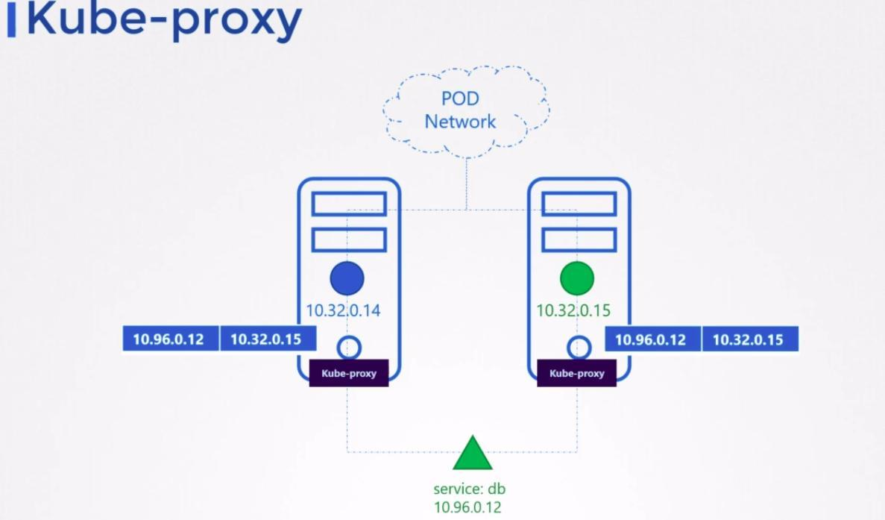
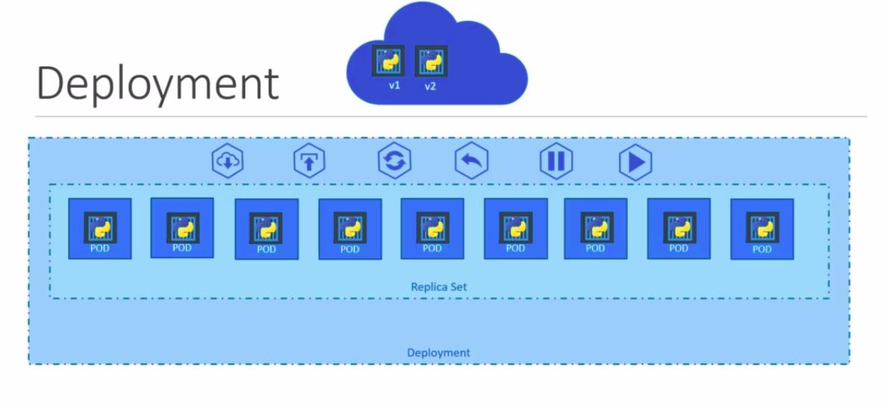
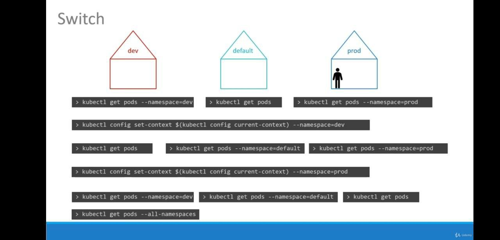
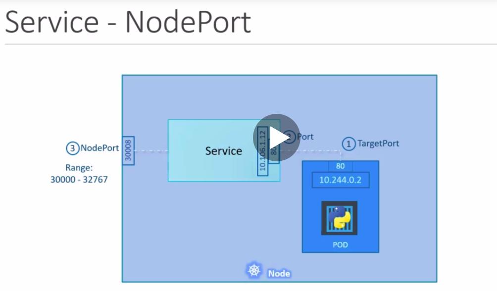

# CKA (Certified Kubernetes Administrator)
> https://www.cncf.io/certification/cka/

- Core Concepts - `19%`
  - Cluster architecture
  - Services & other network primitives
  - API primitives
- Scheduling - `5%`
  - Labels & Selectors
  - Daemon Sets
  - Configure kubernetes scheduler
  - Resource limits
  - Multiple scheduler
  - Manual scheduling
  - Scheduler events
- Logging / Monitoring - `5%`
  - Monitor cluster components
  - Monitor cluster component logs
  - Monitor Applications
  - Application logs
- Application Lifecycle Management - `8%`
  - Rolling updates and rollbacks in deploy
  - Configure Applications
  - Scale applications
  - Self-healing application
- Cluster Maintenance - `11%`
  - Cluster upgrade process
  - Operationg system upgrades
  - Backup and restore methodologies
- Security - `12%`
  - Authentication & Authentization
  - Kubernetes Security
  - Network policies
  - TLS certificates for cluster components
  - Images securely
  - Security contexts
  - Secure persistent key value store
- Storage - `7%`
  - persistent volumes
  - Access modes for volumes
  - Persistent volume claims
  - Kubernetes storage object
  - Configure application with persistent store
- Networking - `11%`
  - Pre-requisites
  - Network, switching, Routing, Tools
  - Pre-requisites - DNS and CoreDNS
  - Networking Configuration on cluster nodes
  - POD networking Concepts
  - Network loadbalancer
  - Ingress
  - Cluster DNS
  - CNI
  - Pre-requisites - network namespaces
  - Pre-requisites - Network in docker
- Installation, Configuration & Validation - `12%`
- Troubleshooting - `10%`
  - Application failure
  - Control plane failure
  - Worker node failure
  - Networking

# Informações sobre a certificação

## Use the code - DEVOPS15 - while registering for the CKA or CKAD exams at Linux Foundation to get a 15% discount.

- [Certified Kubernetes Administrator:](https://www.cncf.io/certification/cka/)
- [Exma tips](https://training.linuxfoundation.org/wp-content/uploads/2020/03/Important-Tips-CKA-CKAD-March-2020.pdf)
- [Exma tips2](https://training.linuxfoundation.org/wp-content/uploads/2020/04/CKA-CKAD-Candidate-Handbook-v1.10.pdf)
- [Github CNCF curriculum](https://github.com/cncf/curriculum)
- [CKA Curriculum V1.17](https://github.com/cncf/curriculum/blob/master/CKA_Curriculum_V1.17.pdf)

## Kubernetes the hard way

- https://github.com/mmumshad/kubernetes-the-hard-way

---

# Core Concepts - `19%`

## Cluster architecture

**Master node - Control plane**

- Manage
- Plan
- Schedule
- Monitor
- Nodes

### Master Components

- ETCD - armazena dados do cluster, formato key-value
- Scheduler - responsável por verificar se existe recurso em um node e realizar o deploy do pod
-  Controller-manager - responsável por gerenciar controllers e nodes
- Kube-api - responsável por todas operações dentro do cluster


**Worker node**

- Host aplication as containers

### Nodes components - all nodes

- Container runtimer (docker, ContainerD e etc)
- Kubelet - recebe e executa instruções do contral plane
- kube-proxy - responsável pela comunicação entre componentes do cluster, como services, pods e etc.

###**Conrol plane components**

#### ETCD

**What is [ETCD](https://kubernetes.io/docs/concepts/overview/components/#etcd)?**
> https://etcd.io/docs/v3.4.0/

ETCD is a distributed reliable key-value store that is simple, secure & fast, your default port is `2379`.

**Explore ETCD**

```
kubectl exec etcd-master -n kube-system etcdctl get / --prefix -key-only
```

#### Kube-API

É o unico componente que comunica com o ETCD, todos demais componentes devem se comunicar com o kube-api para que o kube-api se comunique com o ETCD.


**Create pod flow**

1 - Authenticate user
2 - Validate request
3 - Retrieve data
4 - Update ETCD
5 - Scheduler
6 - Kubelet
7 - Update ETCD com o status do deploy do pod.

**Path configfile - setup kubeadm**

- `/etc/kubernetes/manifests/kube-apiserver.yaml`

- `/etc/systemd/system/kube-apiserver.service`

#### Controller-manager

- Watch status
- Remediate situation

Manager and monitoring every single controller:

- Deployment
- Replicaset
- ReplicationController
- Statefulset
- CronJob
- Namespace-controller
- Endpoing-controller
- Job-controller
- PV- protection-controller
- Pv-binder-controller

**Node controller**

Check node every `5s` and is the node doesn't retry in `40s`, it's mark as `unreachable` and `5m` later `notReady`


#### Kube-scheduler

Responsable to say where each pod go to each node, and to the Kubelet plays. kube-scheduler try to find the best node to the pod, first it make the filter nodes and after rank Nodes.

#### Kubelet

It's node's agente, it receive control planes commands, and play, it regiser node, create pods, monitor node & pods.

#### Kube-proxy



#### Pods

It's the must basic kubernetes object, it can have one or more container inside then.

> Tip: Inside the pod, it's good practices don't have the same kind of container inside then

**Create new pod aplication**
> https://kubernetes.io/docs/reference/kubectl/docker-cli-to-kubectl/

```
kubectl run --image=nginx nginx-app --port=80
```

YAML file

```
apiVersion: v1
kind: Pod
metadata:
  name: exmplo-pod
  labels:
    app: exemplo
spec:
  containers:
    - name: container-exemplo
      image: nginx
```

#### Controllers

**Replicaset vs Replication Controller**
> https://kubernetes.io/docs/concepts/workloads/controllers/replicaset/
https://kubernetes.io/docs/concepts/workloads/controllers/replicationcontroller/


It's controller to keep the pods up, if happening some error it try to up the pods again

```
apiVersion: v1
kind: ReplicationController
metadata:
  name: rc-myapp
  labels:
    app: myappp
    type: front-end
spec:
  replicas: 3
  template:
    metadata:
      name: myapp-pod
      labels:
        app: myapp
        type: front-end
    spec:
      containers:
      - name: nginx-container
        image: nginx
```

```
apiVersion: app/v1
kind: ReplicaSet
metadata:
  name: rs-myapp
  labels:
    app: myapp
    type: front-end
spec:
  replicas: 3
  template:
    metadata:
      name: myapp-pod
      labels:
        app: myapp
        type: front-end
    spec:
      containers:
      - name: nginx-container
        image: nginx
  selector: # this options doesn't existe on ReplicationController
    matchLabels:
      type: myapp
```

**deployment**
> https://kubernetes.io/docs/concepts/workloads/controllers/deployment/

A Deployment provides declarative updates for Pods and ReplicaSets.

You describe a desired state in a Deployment, and the Deployment Controller changes the actual state to the desired state at a controlled rate. You can define Deployments to create new ReplicaSets, or to remove existing Deployments and adopt all their resources with new Deployments.

- Create
```
kubectl create deployment my-app-teste --image=busybox
kubectl run my-app --image=nginx --replicas=2 --port=80
```
- Update
```
kubectl set image deploy my-app-teste busybox=nginx
```
- Rollback
```
kubectl rollout history deploy my-app-teste
kubectl rollout undo deploy my-app-teste # volta ao status anterior
```
- Scaling
```
kubectl scale deploy my-app-teste --replicas=X
```
- Pausing
```
kubectl rollout pause deploy my-app-teste
kubectl rollout resume deploy my-app-teste # despausar
```



**YAML**

```
apiVersion: apps/v1
kind: Deployment
metadata:
  creationTimestamp: null
  labels:
    app: my-app-teste
  name: my-app-teste
spec:
  replicas: 1
  selector:
    matchLabels:
      app: my-app-teste
  strategy: {}
  template:
    metadata:
      creationTimestamp: null
      labels:
        app: my-app-teste
    spec:
      containers:
      - image: busybox
        name: busybox
        resources: {}
status: {}
```


---
## Certification Tip!

Here's a tip!

As you might have seen already, it is a bit difficult to create and edit YAML files. Especially in the CLI. During the exam, you might find it difficult to copy and paste YAML files from browser to terminal. Using the kubectl run command can help in generating a YAML template. And sometimes, you can even get away with just the kubectl run command without having to create a YAML file at all. For example, if you were asked to create a pod or deployment with specific name and image you can simply run the kubectl run command.

Use the below set of commands and try the previous practice tests again, but this time try to use the below commands instead of YAML files. Try to use these as much as you can going forward in all exercises

Reference (Bookmark this page for exam. It will be very handy):

https://kubernetes.io/docs/reference/kubectl/conventions/

Create an NGINX Pod

```
kubectl run --generator=run-pod/v1 nginx --image=nginx
```


Generate POD Manifest YAML file (-o yaml). Don't create it(--dry-run)

```
kubectl run --generator=run-pod/v1 nginx --image=nginx --dry-run -o yaml
```


Create a deployment

```
kubectl create deployment --image=nginx nginx
```

Generate Deployment YAML file (-o yaml). Don't create it(--dry-run)

```
kubectl create deployment --image=nginx nginx --dry-run -o yaml
```

Generate Deployment YAML file (-o yaml). Don't create it(--dry-run) with 4 Replicas (--replicas=4)

```
kubectl create deployment --image=nginx nginx --dry-run -o yaml > nginx-deployment.yaml
```

Save it to a file, make necessary changes to the file (for example, adding more replicas) and then create the deployment.

---

## Namespace
> https://kubernetes.io/docs/concepts/overview/working-with-objects/namespaces/

Kubernetes supports multiple virtual clusters backed by the same physical cluster. These virtual clusters are called namespaces.



**Create**
```
kubectl create namespace <nome namespace>
# or
kubectl create ns <nome namespace>
```
**Delete**
```
kubectl delete namespace <nome namespace>
# or
kubectl delete ns <nome namespace>
```

**List**

```
kubectl get --namespace kube-system pods
```

**Describe**

```
kubectl describe ns kube-system
```
**Limit range**
> https://kubernetes.io/docs/tasks/administer-cluster/manage-resources/memory-default-namespace/


Basicamente define um limite pãdro de recursos (memory e CPU) que é automaticamente aplicado em cada pod, se caso já existir um limite no pod maior que o limite definido ele ficará com `pending`, por falta de recursos.

```
apiVersion: v1
kind: LimitRange
metadata:
  name: mem-limit-range
spec:
  limits:
  - default:
      memory: 512Mi
    defaultRequest:
      memory: 256Mi
    type: Container
```


**Namespace quote resource**
> https://kubernetes.io/docs/tasks/administer-cluster/manage-resources/quota-memory-cpu-namespace/#create-a-resourcequota
https://kubernetes.io/docs/tasks/administer-cluster/manage-resources/memory-constraint-namespace/

Limite máximo do namespace.

The ResourceQuota places these requirements on the quota-mem-cpu-example namespace:

- Every Container must have a memory request, memory limit, cpu - request, and cpu limit.
- The memory request total for all Containers must not exceed 1 - GiB.
- The memory limit total for all Containers must not exceed 2 GiB.
- The CPU request total for all Containers must not exceed 1 cpu.
- The CPU limit total for all Containers must not exceed 2 cpu.


**CLI**

```
kubectl -n teste create quota quota-teste --hard=cpu=1,memory=100m,pods=2,services=2,replicationcontrollers=2,resourcequotas=1,secrets=5,persistentvolumeclaims=10
```

**YAML**

```
apiVersion: v1
kind: ResourceQuota
metadata:
  creationTimestamp: null
  name: quota-teste
  namespace: teste
spec:
  hard:
    cpu: "1"
    memory: 100m
    persistentvolumeclaims: "10"
    pods: "2"
    replicationcontrollers: "2"
    resourcequotas: "1"
    secrets: "5"
    services: "2"
```

---

## Service
> https://kubernetes.io/docs/tutorials/services/source-ip/

Service é um objeto que permite externalizar aplicações do pod via HTTP/HTTPS, existem três tipos `ClusterIP`,`NodePort` e `LoadBalancer`.



**Create**
> https://kubernetes.io/docs/reference/generated/kubectl/kubectl-commands#-em-service-clusterip-em-

```
kubectl create svc clusterip svc-teste --tcp=80:8080
kubectl create svc loadbalancer svc-teste --tcp=80:8080
kubectl create svc nodeport svc-teste --tcp=80:8080 --node-port=30001
```

**Expose deploy (create service baseado no deployment)**

```
kubectl expose deployment teste  --selector="run=teste" --port=80 --target-port=8080
```

****************

## Certification Tips - Imperative Commands with Kubectl
> https://kubernetes.io/docs/reference/kubectl/conventions/

While you would be working mostly the declarative way - using definition files, imperative commands can help in getting one time tasks done quickly, as well as generate a definition template easily. This would help save considerable amount of time during your exams.

Before we begin, familiarize with the two options that can come in handy while working with the below commands:

`--dry-run`: By default as soon as the command is run, the resource will be created. If you simply want to test your command , use the `--dry-run` option. This will not create the resource, instead, tell you weather the resource can be created and if your command is right.

`-o yaml`: This will output the resource definition in YAML format on screen.


Use the above two in combination to generate a resource definition file quickly, that you can then modify and create resources as required, instead of creating the files from scratch.


**POD**

Create an NGINX Pod

```
kubectl run --generator=run-pod/v1 nginx --image=nginx
```

Generate POD Manifest YAML file (-o yaml). Don't create it(--dry-run)

```
kubectl run --generator=run-pod/v1 nginx --image=nginx --dry-run -o yaml
```

** Busybox
```
kubectl run --generator=run-pod/v1 curl-pod --rm -ti --image=busybox --restart=Never -- sh
```


**Deployment**

Create a deployment

```
kubectl create deployment --image=nginx nginx
```

Generate Deployment YAML file (-o yaml). Don't create it(--dry-run)
```
kubectl create deployment --image=nginx nginx --dry-run -o yaml
```

Generate Deployment YAML file (-o yaml). Don't create it(--dry-run) with 4 Replicas (--replicas=4)

```
kubectl run --generator=deployment/v1beta1 nginx --image=nginx --dry-run --replicas=4 -o yaml
```

The usage --generator=deployment/v1beta1 is deprecated as of Kubernetes 1.16. The recommended way is to use the kubectl create option instead.


**IMPORTANT:**

kubectl create deployment does not have a --replicas option. You could first create it and then scale it using the kubectl scale command.

Save it to a file - (If you need to modify or add some other details)

```
kubectl run --generator=deployment/v1beta1 nginx --image=nginx --dry-run --replicas=4 -o yaml > nginx-deployment.yaml
```

OR

```
kubectl create deployment --image=nginx nginx --dry-run -o yaml > nginx-deployment.yaml
```

You can then update the YAML file with the replicas or any other field before creating the deployment.


**Service**

Create a Service named redis-service of type ClusterIP to expose pod redis on port 6379

```
kubectl expose pod redis --port=6379 --name redis-service --dry-run -o yaml
```

(This will automatically use the pod's labels as selectors)

Or

This will not use the pods labels as selectors, instead it will assume selectors as app=redis. You cannot pass in selectors as an option. So it does not work very well if your pod has a different label set. So generate the file and modify the selectors before creating the service

```
kubectl create service clusterip redis --tcp=6379:6379 --dry-run -o yaml  
```

Create a Service named nginx of type NodePort to expose pod nginx's port 80 on port 30080 on the nodes:

```
kubectl expose pod nginx --port=80 --name nginx-service --dry-run -o yaml
```

(This will automatically use the pod's labels as selectors, but you cannot specify the node port. You have to generate a definition file and then add the node port in manually before creating the service with the pod.)

Or

```
kubectl create service nodeport nginx --tcp=80:80 --node-port=30080 --dry-run -o yaml
```

(This will not use the pods labels as selectors)

Both the above commands have their own challenges. While one of it cannot accept a selector the other cannot accept a node port. I would recommend going with the `kubectl expose` command. If you need to specify a node port, generate a definition file using the same command and manually input the nodeport before creating the service.

---

# Scheduling - `5%`

> https://kubernetes.io/docs/concepts/scheduling-eviction/kube-scheduler/
https://kubernetes.io/docs/tasks/configure-pod-container/assign-pods-nodes/#create-a-pod-that-gets-scheduled-to-specific-node

In Kubernetes, scheduling refers to making sure that Pods are matched to Nodes so that Kubelet can run them.

**Manual scheduling**

```
apiVersion: v1
kind: Pod
metadata:
  name: nginx
spec:
  nodeName: foo-node # schedule pod to specific node
  containers:
  - name: nginx
    image: nginx
    imagePullPolicy: IfNotPresent
```

**Labels and selector**

```
apiVersion: v1
kind: Pod
metadata:
  name: nginx
  labels:
    app: nginx
    type: frontend
spec:
  nodeName: foo-node # schedule pod to specific node
  containers:
  - name: nginx
    image: nginx
    imagePullPolicy: IfNotPresent
```

**Selector**
```
kubectl run teste --image=nginx --labels="app=nginx,env=prod"
kubectl get pods --show-labels
kubectl get pods -L app,env
kubectl get pod --selector app=nginx
kubectl get pod --selector app=nginx,env=prod
```

**Annotations**

You can use Kubernetes annotations to attach arbitrary non-identifying metadata to objects. Clients such as tools and libraries can retrieve this metadata.

```
apiVersion: v1
kind: Pod
metadata:
  name: annotations-demo
  annotations:
    imageregistry: "https://hub.docker.com/"
spec:
  containers:
  - name: nginx
    image: nginx:1.14.2
    ports:
    - containerPort: 80
```

## Taint and Toleration

> https://kubernetes.io/docs/concepts/configuration/taint-and-toleration/

Taints and tolerations work together to ensure that pods are not scheduled onto inappropriate nodes. One or more taints are applied to a node; this marks that the node should not accept any pods that do not tolerate the taints. Tolerations are applied to pods, and allow (but do not require) the pods to schedule onto nodes with matching taints.

Effect

- NoSchedule: if there is at least one un-ignored taint with effect NoSchedule then Kubernetes will not schedule the pod onto that node.
- PreferNoSchedule: f there is no un-ignored taint with effect NoSchedule but there is at least one un-ignored taint with effect PreferNoSchedule then Kubernetes will try to not schedule the pod onto the node.
- NoExecute: if there is at least one un-ignored taint with effect NoExecute then the pod will be evicted from the node (if it is already running on the node), and will not be scheduled onto the node (if it is not yet running on the node).


```
kubectl taint nodes gke-lab-cka-default-pool-16b589fc-894f app=blue:NoSchedule # add apenas app blue podem executadas neste node
kubectl taint nodes gke-lab-cka-default-pool-16b589fc-894f app:NoSchedule- # removendo taint
```
**Toleration**

A toleration “matches” a taint if the keys are the same and the effects are the same, and:

- the operator is Exists (in which case no value should be - specified), or
- the operator is Equal and the values are equal


```
apiVersion: apps/v1
kind: Deployment
metadata:
  labels:
    app: nginx
    env: prod
  name: front-blue
spec:
  replicas: 1
  selector:
    matchLabels:
      app: nginx
      env: prod
  strategy:
    rollingUpdate:
      maxSurge: 25%
      maxUnavailable: 25%
    type: RollingUpdate
  template:
    metadata:
      labels:
        app: nginx
        env: prod
    spec:
      tolerations:
      - key: "app"
        operator: "Equal"
        value: "blue"
        effect: "NoSchedule"
      containers:
      - image: nginx
        imagePullPolicy: Always
        name: front-blue
```

**Node selector**

> https://kubernetes.io/docs/concepts/configuration/assign-pod-node/#nodeselector

We can create a label to identify some node, for exemplo kind of disktype

- With node selector you don't hava condictions as Large OR Medium
- NOT Small

```
kubectl label node <node name> <key>=value
```

```
pods/pod-nginx.yaml

apiVersion: v1
kind: Pod
metadata:
  name: nginx
  labels:
    env: test
spec:
  containers:
  - name: nginx
    image: nginx
    imagePullPolicy: IfNotPresent
  nodeSelector:
    disktype: ssd # label node
```

**Node affinity and anti-affinity**

> https://kubernetes.io/docs/concepts/configuration/assign-pod-node/#affinity-and-anti-affinity

Node affinity is conceptually similar to nodeSelector -- it allows you to constrain which nodes your pod is eligible to be scheduled on, based on labels on the node.


- | DuringScheduling | DuringExecution | Type
:---:|:---:|:---:|:---:|
requiredDuringSchedulingIgnoredDuringExecution | Required | Ignored | Available
preferredDuringSchedulingIgnoredDuringExecution | Preferred | Ignored | Available
requiredDuringSchedulingRequiredDuringExecution | Required | Required | Planned


**In two or more labels**

```
apiVersion: v1
kind: Pod
metadata:
  creationTimestamp: null
  labels:
    run: teste-2
  name: teste-2
spec:
  affinity:
    nodeAffinity:
      requiredDuringSchedulingIgnoredDuringExecution:
        nodeSelectorTerms:
        - matchExpressions:
          - key: size
            operator: In
            values:
            - large
            - medium
  containers:
  - image: nginx
    name: teste-2
  restartPolicy: Always
```

**Not in Label**

```
apiVersion: v1
kind: Pod
metadata:
  creationTimestamp: null
  labels:
    run: teste-3
  name: teste-3
spec:
  affinity:
    nodeAffinity:
      requiredDuringSchedulingIgnoredDuringExecution:
        nodeSelectorTerms:
        - matchExpressions:
          - key: size
            operator: NotIn
            values:
            - large
  containers:
  - image: nginx
    name: teste-3
  restartPolicy: Always
```

**Exist label**

```
apiVersion: v1
kind: Pod
metadata:
  creationTimestamp: null
  labels:
    run: teste-5
  name: teste-5
spec:
  affinity:
    nodeAffinity:
      requiredDuringSchedulingIgnoredDuringExecution:
        nodeSelectorTerms:
        - matchExpressions:
          - key: size
            operator: Exists
  containers:
  - image: nginx
    name: teste-5
  restartPolicy: Always
```


****************
