# CKA (Certified Kubernetes Administrator)
> https://www.cncf.io/certification/cka/

- Core Concepts - `19%`
  - Cluster architecture
  - Services & other network primitives
  - API primitives
- Scheduling - `5%`
  - Labels & Selectors
  - Daemon Sets
  - Configure kubernetes scheduler
  - Resource limits
  - Multiple scheduler
  - Manual scheduling
  - Scheduler events
- Logging / Monitoring - `5%`
  - Monitor cluster components
  - Monitor cluster component logs
  - Monitor Applications
  - Application logs
- Application Lifecycle Management - `8%`
  - Rolling updates and rollbacks in deploy
  - Configure Applications
  - Scale applications
  - Self-healing application
- Cluster Maintenance - `11%`
  - Cluster upgrade process
  - Operationg system upgrades
  - Backup and restore methodologies
- Security - `12%`
  - Authentication & Authentization
  - Kubernetes Security
  - Network policies
  - TLS certificates for cluster components
  - Images securely
  - Security contexts
  - Secure persistent key value store
- Storage - `7%`
  - persistent volumes
  - Access modes for volumes
  - Persistent volume claims
  - Kubernetes storage object
  - Configure application with persistent store
- Networking - `11%`
  - Pre-requisites
  - Network, switching, Routing, Tools
  - Pre-requisites - DNS and CoreDNS
  - Networking Configuration on cluster nodes
  - POD networking Concepts
  - Network loadbalancer
  - Ingress
  - Cluster DNS
  - CNI
  - Pre-requisites - network namespaces
  - Pre-requisites - Network in docker
- Installation, Configuration & Validation - `12%`
- Troubleshooting - `10%`
  - Application failure
  - Control plane failure
  - Worker node failure
  - Networking

# Informações sobre a certificação

## Use the code - DEVOPS15 - while registering for the CKA or CKAD exams at Linux Foundation to get a 15% discount.

- [Certified Kubernetes Administrator:](https://www.cncf.io/certification/cka/)
- [Exma tips](https://training.linuxfoundation.org/wp-content/uploads/2020/03/Important-Tips-CKA-CKAD-March-2020.pdf)
- [Exma tips2](https://training.linuxfoundation.org/wp-content/uploads/2020/04/CKA-CKAD-Candidate-Handbook-v1.10.pdf)
- [Github CNCF curriculum](https://github.com/cncf/curriculum)
- [CKA Curriculum V1.17](https://github.com/cncf/curriculum/blob/master/CKA_Curriculum_V1.17.pdf)

## Kubernetes the hard way

- https://github.com/mmumshad/kubernetes-the-hard-way

---

# Core Concepts - `19%`

## Cluster architecture

**Master node - Control plane**

- Manage
- Plan
- Schedule
- Monitor
- Nodes

### Master Components

- ETCD - armazena dados do cluster, formato key-value
- Scheduler - responsável por verificar se existe recurso em um node e realizar o deploy do pod
-  Controller-manager - responsável por gerenciar controllers e nodes
- Kube-api - responsável por todas operações dentro do cluster


**Worker node**

- Host aplication as containers

### Nodes components - all nodes

- Container runtimer (docker, ContainerD e etc)
- Kubelet - recebe e executa instruções do contral plane
- kube-proxy - responsável pela comunicação entre componentes do cluster, como services, pods e etc.

###**Conrol plane components**

#### ETCD

**What is [ETCD](https://kubernetes.io/docs/concepts/overview/components/#etcd)?**
> https://etcd.io/docs/v3.4.0/

ETCD is a distributed reliable key-value store that is simple, secure & fast, your default port is `2379`.

**Explore ETCD**

```
kubectl exec etcd-master -n kube-system etcdctl get / --prefix -key-only
```

#### Kube-API

É o unico componente que comunica com o ETCD, todos demais componentes devem se comunicar com o kube-api para que o kube-api se comunique com o ETCD.


**Create pod flow**

1 - Authenticate user
2 - Validate request
3 - Retrieve data
4 - Update ETCD
5 - Scheduler
6 - Kubelet
7 - Update ETCD com o status do deploy do pod.

**Path configfile - setup kubeadm**

- `/etc/kubernetes/manifests/kube-apiserver.yaml`

- `/etc/systemd/system/kube-apiserver.service`

#### Controller-manager

- Watch status
- Remediate situation

Manager and monitoring every single controller:

- Deployment
- Replicaset
- ReplicationController
- Statefulset
- CronJob
- Namespace-controller
- Endpoing-controller
- Job-controller
- PV- protection-controller
- Pv-binder-controller

**Node controller**

Check node every `5s` and is the node doesn't retry in `40s`, it's mark as `unreachable` and `5m` later `notReady`


#### Kube-scheduler

Responsable to say where each pod go to each node, and to the Kubelet plays. kube-scheduler try to find the best node to the pod, first it make the filter nodes and after rank Nodes.

#### Kubelet

It's node's agente, it receive control planes commands, and play, it regiser node, create pods, monitor node & pods.

#### Kube-proxy


#### Pods

It's the must basic kubernetes object, it can have one or more container inside then.

> Tip: Inside the pod, it's good practices don't have the same kind of container inside then

**Create new pod aplication**
> https://kubernetes.io/docs/reference/kubectl/docker-cli-to-kubectl/

```
kubectl run --image=nginx nginx-app --port=80
```

YAML file

```
apiVersion: v1
kind: Pod
metadata:
  name: exmplo-pod
  labels:
    app: exemplo
spec:
  containers:
    - name: container-exemplo
      image: nginx
```

#### Controllers

**Replicaset vs Replication Controller**
> https://kubernetes.io/docs/concepts/workloads/controllers/replicaset/
https://kubernetes.io/docs/concepts/workloads/controllers/replicationcontroller/


It's controller to keep the pods up, if happening some error it try to up the pods again

```
apiVersion: v1
kind: ReplicationController
metadata:
  name: rc-myapp
  labels:
    app: myappp
    type: front-end
spec:
  replicas: 3
  template:
    metadata:
      name: myapp-pod
      labels:
        app: myapp
        type: front-end
    spec:
      containers:
      - name: nginx-container
        image: nginx
```

```
apiVersion: app/v1
kind: ReplicaSet
metadata:
  name: rs-myapp
  labels:
    app: myapp
    type: front-end
spec:
  replicas: 3
  template:
    metadata:
      name: myapp-pod
      labels:
        app: myapp
        type: front-end
    spec:
      containers:
      - name: nginx-container
        image: nginx
  selector: # this options doesn't existe on ReplicationController
    matchLabels:
      type: myapp
```

**deployment**
> https://kubernetes.io/docs/concepts/workloads/controllers/deployment/

A Deployment provides declarative updates for Pods and ReplicaSets.

You describe a desired state in a Deployment, and the Deployment Controller changes the actual state to the desired state at a controlled rate. You can define Deployments to create new ReplicaSets, or to remove existing Deployments and adopt all their resources with new Deployments.

- Create
```
kubectl create deployment my-app-teste --image=busybox
kubectl run my-app --image=nginx --replicas=2 --port=80
```
- Update
```
kubectl set image deploy my-app-teste busybox=nginx
```
- Rollback
```
kubectl rollout history deploy my-app-teste
kubectl rollout undo deploy my-app-teste # volta ao status anterior
```
- Scaling
```
kubectl scale deploy my-app-teste --replicas=X
```
- Pausing
```
kubectl rollout pause deploy my-app-teste
kubectl rollout resume deploy my-app-teste # despausar
```


**YAML**

```
apiVersion: apps/v1
kind: Deployment
metadata:
  creationTimestamp: null
  labels:
    app: my-app-teste
  name: my-app-teste
spec:
  replicas: 1
  selector:
    matchLabels:
      app: my-app-teste
  strategy: {}
  template:
    metadata:
      creationTimestamp: null
      labels:
        app: my-app-teste
    spec:
      containers:
      - image: busybox
        name: busybox
        resources: {}
status: {}
```


---
## Certification Tip!

Here's a tip!

As you might have seen already, it is a bit difficult to create and edit YAML files. Especially in the CLI. During the exam, you might find it difficult to copy and paste YAML files from browser to terminal. Using the kubectl run command can help in generating a YAML template. And sometimes, you can even get away with just the kubectl run command without having to create a YAML file at all. For example, if you were asked to create a pod or deployment with specific name and image you can simply run the kubectl run command.

Use the below set of commands and try the previous practice tests again, but this time try to use the below commands instead of YAML files. Try to use these as much as you can going forward in all exercises

Reference (Bookmark this page for exam. It will be very handy):

https://kubernetes.io/docs/reference/kubectl/conventions/

Create an NGINX Pod

```
kubectl run --generator=run-pod/v1 nginx --image=nginx
```


Generate POD Manifest YAML file (-o yaml). Don't create it(--dry-run)

```
kubectl run --generator=run-pod/v1 nginx --image=nginx --dry-run -o yaml
```


Create a deployment

```
kubectl create deployment --image=nginx nginx
```

Generate Deployment YAML file (-o yaml). Don't create it(--dry-run)

```
kubectl create deployment --image=nginx nginx --dry-run -o yaml
```

Generate Deployment YAML file (-o yaml). Don't create it(--dry-run) with 4 Replicas (--replicas=4)

```
kubectl create deployment --image=nginx nginx --dry-run -o yaml > nginx-deployment.yaml
```

Save it to a file, make necessary changes to the file (for example, adding more replicas) and then create the deployment.

---

## Namespace
> https://kubernetes.io/docs/concepts/overview/working-with-objects/namespaces/

Kubernetes supports multiple virtual clusters backed by the same physical cluster. These virtual clusters are called namespaces.


**Create**
```
kubectl create namespace <nome namespace>
# or
kubectl create ns <nome namespace>
```
**Delete**
```
kubectl delete namespace <nome namespace>
# or
kubectl delete ns <nome namespace>
```

**List**

```
kubectl get --namespace kube-system pods
```

**Describe**

```
kubectl describe ns kube-system
```
**Limit range**
> https://kubernetes.io/docs/tasks/administer-cluster/manage-resources/memory-default-namespace/


Basicamente define um limite pãdro de recursos (memory e CPU) que é automaticamente aplicado em cada pod, se caso já existir um limite no pod maior que o limite definido ele ficará com `pending`, por falta de recursos.

```
apiVersion: v1
kind: LimitRange
metadata:
  name: mem-limit-range
spec:
  limits:
  - default:
      memory: 512Mi
    defaultRequest:
      memory: 256Mi
    type: Container
```


**Namespace quote resource**
> https://kubernetes.io/docs/tasks/administer-cluster/manage-resources/quota-memory-cpu-namespace/#create-a-resourcequota
https://kubernetes.io/docs/tasks/administer-cluster/manage-resources/memory-constraint-namespace/

Limite máximo do namespace.

The ResourceQuota places these requirements on the quota-mem-cpu-example namespace:

- Every Container must have a memory request, memory limit, cpu - request, and cpu limit.
- The memory request total for all Containers must not exceed 1 - GiB.
- The memory limit total for all Containers must not exceed 2 GiB.
- The CPU request total for all Containers must not exceed 1 cpu.
- The CPU limit total for all Containers must not exceed 2 cpu.


**CLI**

```
kubectl -n teste create quota quota-teste --hard=cpu=1,memory=100m,pods=2,services=2,replicationcontrollers=2,resourcequotas=1,secrets=5,persistentvolumeclaims=10
```

**YAML**

```
apiVersion: v1
kind: ResourceQuota
metadata:
  creationTimestamp: null
  name: quota-teste
  namespace: teste
spec:
  hard:
    cpu: "1"
    memory: 100m
    persistentvolumeclaims: "10"
    pods: "2"
    replicationcontrollers: "2"
    resourcequotas: "1"
    secrets: "5"
    services: "2"
```

---

## Service
> https://kubernetes.io/docs/tutorials/services/source-ip/

Service é um objeto que permite externalizar aplicações do pod via HTTP/HTTPS, existem três tipos `ClusterIP`,`NodePort` e `LoadBalancer`.


**Create**
> https://kubernetes.io/docs/reference/generated/kubectl/kubectl-commands#-em-service-clusterip-em-

```
kubectl create svc clusterip svc-teste --tcp=80:8080
kubectl create svc loadbalancer svc-teste --tcp=80:8080
kubectl create svc nodeport svc-teste --tcp=80:8080 --node-port=30001
```

**Expose deploy (create service baseado no deployment)**

```
kubectl expose deployment teste  --selector="run=teste" --port=80 --target-port=8080
```

****************

## Certification Tips - Imperative Commands with Kubectl
> https://kubernetes.io/docs/reference/kubectl/conventions/

While you would be working mostly the declarative way - using definition files, imperative commands can help in getting one time tasks done quickly, as well as generate a definition template easily. This would help save considerable amount of time during your exams.

Before we begin, familiarize with the two options that can come in handy while working with the below commands:

`--dry-run`: By default as soon as the command is run, the resource will be created. If you simply want to test your command , use the `--dry-run` option. This will not create the resource, instead, tell you weather the resource can be created and if your command is right.

`-o yaml`: This will output the resource definition in YAML format on screen.


Use the above two in combination to generate a resource definition file quickly, that you can then modify and create resources as required, instead of creating the files from scratch.


**POD**

Create an NGINX Pod

```
kubectl run --generator=run-pod/v1 nginx --image=nginx
```

Generate POD Manifest YAML file (-o yaml). Don't create it(--dry-run)

```
kubectl run --generator=run-pod/v1 nginx --image=nginx --dry-run -o yaml
```

** Busybox
```
kubectl run --generator=run-pod/v1 curl-pod --rm -ti --image=busybox --restart=Never -- sh
```


**Deployment**

Create a deployment

```
kubectl create deployment --image=nginx nginx
```

Generate Deployment YAML file (-o yaml). Don't create it(--dry-run)
```
kubectl create deployment --image=nginx nginx --dry-run -o yaml
```

Generate Deployment YAML file (-o yaml). Don't create it(--dry-run) with 4 Replicas (--replicas=4)

```
kubectl run --generator=deployment/v1beta1 nginx --image=nginx --dry-run --replicas=4 -o yaml
```

The usage --generator=deployment/v1beta1 is deprecated as of Kubernetes 1.16. The recommended way is to use the kubectl create option instead.


**IMPORTANT:**

kubectl create deployment does not have a --replicas option. You could first create it and then scale it using the kubectl scale command.

Save it to a file - (If you need to modify or add some other details)

```
kubectl run --generator=deployment/v1beta1 nginx --image=nginx --dry-run --replicas=4 -o yaml > nginx-deployment.yaml
```

OR

```
kubectl create deployment --image=nginx nginx --dry-run -o yaml > nginx-deployment.yaml
```

You can then update the YAML file with the replicas or any other field before creating the deployment.


**Service**

Create a Service named redis-service of type ClusterIP to expose pod redis on port 6379

```
kubectl expose pod redis --port=6379 --name redis-service --dry-run -o yaml
```

(This will automatically use the pod's labels as selectors)

Or

This will not use the pods labels as selectors, instead it will assume selectors as app=redis. You cannot pass in selectors as an option. So it does not work very well if your pod has a different label set. So generate the file and modify the selectors before creating the service

```
kubectl create service clusterip redis --tcp=6379:6379 --dry-run -o yaml  
```

Create a Service named nginx of type NodePort to expose pod nginx's port 80 on port 30080 on the nodes:

```
kubectl expose pod nginx --port=80 --name nginx-service --dry-run -o yaml
```

(This will automatically use the pod's labels as selectors, but you cannot specify the node port. You have to generate a definition file and then add the node port in manually before creating the service with the pod.)

Or

```
kubectl create service nodeport nginx --tcp=80:80 --node-port=30080 --dry-run -o yaml
```

(This will not use the pods labels as selectors)

Both the above commands have their own challenges. While one of it cannot accept a selector the other cannot accept a node port. I would recommend going with the `kubectl expose` command. If you need to specify a node port, generate a definition file using the same command and manually input the nodeport before creating the service.

---

# Scheduling - `5%`

> https://kubernetes.io/docs/concepts/scheduling-eviction/kube-scheduler/
https://kubernetes.io/docs/tasks/configure-pod-container/assign-pods-nodes/#create-a-pod-that-gets-scheduled-to-specific-node

In Kubernetes, scheduling refers to making sure that Pods are matched to Nodes so that Kubelet can run them.

**Manual scheduling**

```
apiVersion: v1
kind: Pod
metadata:
  name: nginx
spec:
  nodeName: foo-node # schedule pod to specific node
  containers:
  - name: nginx
    image: nginx
    imagePullPolicy: IfNotPresent
```

## Labels and selector

```
apiVersion: v1
kind: Pod
metadata:
  name: nginx
  labels:
    app: nginx
    type: frontend
spec:
  nodeName: foo-node # schedule pod to specific node
  containers:
  - name: nginx
    image: nginx
    imagePullPolicy: IfNotPresent
```

**Selector**
```
kubectl run teste --image=nginx --labels="app=nginx,env=prod"
kubectl get pods --show-labels
kubectl get pods -L app,env
kubectl get pod --selector app=nginx
kubectl get pod --selector app=nginx,env=prod
```

**Annotations**

You can use Kubernetes annotations to attach arbitrary non-identifying metadata to objects. Clients such as tools and libraries can retrieve this metadata.

```
apiVersion: v1
kind: Pod
metadata:
  name: annotations-demo
  annotations:
    imageregistry: "https://hub.docker.com/"
spec:
  containers:
  - name: nginx
    image: nginx:1.14.2
    ports:
    - containerPort: 80
```

## Taint and Toleration

> https://kubernetes.io/docs/concepts/configuration/taint-and-toleration/

Taints and tolerations work together to ensure that pods are not scheduled onto inappropriate nodes. One or more taints are applied to a node; this marks that the node should not accept any pods that do not tolerate the taints. Tolerations are applied to pods, and allow (but do not require) the pods to schedule onto nodes with matching taints.

Effect

- NoSchedule: if there is at least one un-ignored taint with effect NoSchedule then Kubernetes will not schedule the pod onto that node.
- PreferNoSchedule: f there is no un-ignored taint with effect NoSchedule but there is at least one un-ignored taint with effect PreferNoSchedule then Kubernetes will try to not schedule the pod onto the node.
- NoExecute: if there is at least one un-ignored taint with effect NoExecute then the pod will be evicted from the node (if it is already running on the node), and will not be scheduled onto the node (if it is not yet running on the node).


```
kubectl taint nodes gke-lab-cka-default-pool-16b589fc-894f app=blue:NoSchedule # add apenas app blue podem executadas neste node
kubectl taint nodes gke-lab-cka-default-pool-16b589fc-894f app:NoSchedule- # removendo taint
```
**Toleration**

A toleration “matches” a taint if the keys are the same and the effects are the same, and:

- the operator is Exists (in which case no value should be - specified), or
- the operator is Equal and the values are equal


```
apiVersion: apps/v1
kind: Deployment
metadata:
  labels:
    app: nginx
    env: prod
  name: front-blue
spec:
  replicas: 1
  selector:
    matchLabels:
      app: nginx
      env: prod
  strategy:
    rollingUpdate:
      maxSurge: 25%
      maxUnavailable: 25%
    type: RollingUpdate
  template:
    metadata:
      labels:
        app: nginx
        env: prod
    spec:
      tolerations:
      - key: "app"
        operator: "Equal"
        value: "blue"
        effect: "NoSchedule"
      containers:
      - image: nginx
        imagePullPolicy: Always
        name: front-blue
```

**Node selector**

> https://kubernetes.io/docs/concepts/configuration/assign-pod-node/#nodeselector

We can create a label to identify some node, for exemplo kind of disktype

- With node selector you don't hava condictions as Large OR Medium
- NOT Small

```
kubectl label node <node name> <key>=value
```

```
pods/pod-nginx.yaml

apiVersion: v1
kind: Pod
metadata:
  name: nginx
  labels:
    env: test
spec:
  containers:
  - name: nginx
    image: nginx
    imagePullPolicy: IfNotPresent
  nodeSelector:
    disktype: ssd # label node
```

**Node affinity and anti-affinity**

> https://kubernetes.io/docs/concepts/configuration/assign-pod-node/#affinity-and-anti-affinity

Node affinity is conceptually similar to nodeSelector -- it allows you to constrain which nodes your pod is eligible to be scheduled on, based on labels on the node.


- | DuringScheduling | DuringExecution | Type
:---:|:---:|:---:|:---:|
requiredDuringSchedulingIgnoredDuringExecution | Required | Ignored | Available
preferredDuringSchedulingIgnoredDuringExecution | Preferred | Ignored | Available
requiredDuringSchedulingRequiredDuringExecution | Required | Required | Planned |


**In two or more labels**

```
apiVersion: v1
kind: Pod
metadata:
  creationTimestamp: null
  labels:
    run: teste-2
  name: teste-2
spec:
  affinity:
    nodeAffinity:
      requiredDuringSchedulingIgnoredDuringExecution:
        nodeSelectorTerms:
        - matchExpressions:
          - key: size
            operator: In
            values:
            - large
            - medium
  containers:
  - image: nginx
    name: teste-2
  restartPolicy: Always
```

**Not in Label**

```
apiVersion: v1
kind: Pod
metadata:
  creationTimestamp: null
  labels:
    run: teste-3
  name: teste-3
spec:
  affinity:
    nodeAffinity:
      requiredDuringSchedulingIgnoredDuringExecution:
        nodeSelectorTerms:
        - matchExpressions:
          - key: size
            operator: NotIn
            values:
            - large
  containers:
  - image: nginx
    name: teste-3
  restartPolicy: Always
```

**Exist label**

```
apiVersion: v1
kind: Pod
metadata:
  creationTimestamp: null
  labels:
    run: teste-5
  name: teste-5
spec:
  affinity:
    nodeAffinity:
      requiredDuringSchedulingIgnoredDuringExecution:
        nodeSelectorTerms:
        - matchExpressions:
          - key: size
            operator: Exists
  containers:
  - image: nginx
    name: teste-5
  restartPolicy: Always
```

### Node affinity VS Taints and Tolerations

**Taints and Tolerations**

Um novo é marcado, para que ele recebera pods que possuem a mesma marca(tain) e tolerancia, porém o pod podera se schedulado em outro node.

**Node affinity**

Identifica um node com uma label e através desta lable o pod sabe em qual node ele será schedulado, isso não garante que outro pods podem ou não se schedulados nesse node.

## Resource limit

> https://kubernetes.io/docs/concepts/configuration/manage-resources-containers/
https://kubernetes.io/docs/tasks/administer-cluster/manage-resources/memory-default-namespace/
https://kubernetes.io/docs/tasks/administer-cluster/manage-resources/cpu-default-namespace/
https://kubernetes.io/docs/tasks/configure-pod-container/assign-memory-resource

**Note on default resource requirements and limits**

In the previous lecture, I said - "When a pod is created the containers are assigned a default CPU request of .5 and memory of 256Mi". For the POD to pick up those defaults you must have first set those as default values for request and limit by creating a LimitRange in that namespace.

**LimitRange memory**

```
apiVersion: v1
kind: LimitRange
metadata:
  name: mem-limit-range
spec:
  limits:
  - default:
      memory: 512Mi
    defaultRequest:
      memory: 256Mi
    type: Container
```

**LimitRange CPU**

```
apiVersion: v1
kind: LimitRange
metadata:
  name: cpu-limit-range
spec:
  limits:
  - default:
      cpu: 1
    defaultRequest:
      cpu: 0.5
    type: Container
```

**YAML**

```
apiVersion: v1
kind: Pod
metadata:
  name: frontend
spec:
  containers:
  - name: db
    image: mysql
    env:
    - name: MYSQL_ROOT_PASSWORD
      value: "password"
    resources:
      requests:
        memory: "64Mi"
        cpu: "250m"
      limits:
        memory: "128Mi"
        cpu: "500m"
```

**CLI**

```
kubectl run teste --image=nginx --requests="cpu=0.2,memory=256Mi" --limits="cpu=0.5,memory=512Mi"
```

## Daemon sets

> https://kubernetes.io/docs/concepts/workloads/controllers/daemonset/

A DaemonSet ensures that all (or some) Nodes run a copy of a Pod. As nodes are added to the cluster, Pods are added to them. As nodes are removed from the cluster, those Pods are garbage collected. Deleting a DaemonSet will clean up the Pods it created.

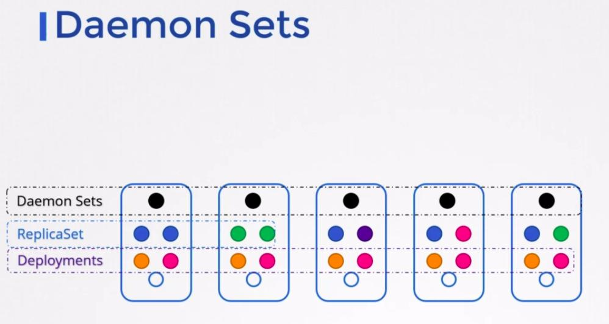

```
apiVersion: apps/v1
kind: DaemonSet
metadata:
  name: monitor-daemon
spec:
  selector:
    matchLabels:
      app: monitor-agent
  template:
    metadata:
      labels:
        app: monitor-agent
    spec:
      containers:
      - name: monitor-agent
        image: monitor-agent:latest
```

## Static pods
> https://kubernetes.io/docs/tasks/configure-pod-container/static-pod/

`Static Pods` are managed directly by the `kubelet` daemon on a specific node, `without the API server observing them`. Unlike Pods that are managed by the control plane (for example, a Deployment); instead, the `kubelet` watches each static Pod (and restarts it if it crashes).

If you lost your nodes master for some reason, you can run the pod alone on the nodes, you can create just `pods`, copy the yaml files to flow directory `/etc/kubernetes/manifests`.

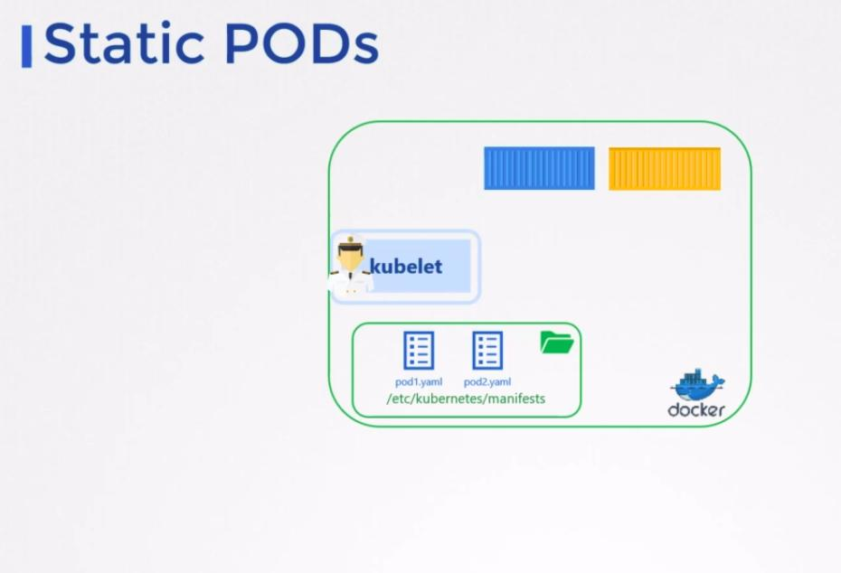

Static PODs | DaemonSet
:---:|:---:
Created bu the kubelet | Created by kube-API server (DaemonSet controller)
Deploy Control plane component `Static Pods` | Deploy Monitoring agents, Logging agents on nodes
Ignored by the kube-scheduler | Ignored by the kube-scheduler

## Multiple schedule

> https://kubernetes.io/docs/tasks/administer-cluster/configure-multiple-schedulers/

---

# Logging / Monitoring - `5%`

**Metrics**
```
minikube addons enable metrics-server
```

**Logs**

> https://kubernetes.io/docs/concepts/cluster-administration/logging/

```
kubectl log <pod name> # show last logs
kubectl log -f <pod name> # show current logs
```

---

# Application Lifecycle Management - `8%`

## Rolling updates and Rollbacks in deployments

**Rollout and versioning**

```
kubectl rollout status <deployment>
```
**Rollback**

```
kubectl rollout history <object> <name> # show the histories objects
kubectl rollout undo deploy <name>
```

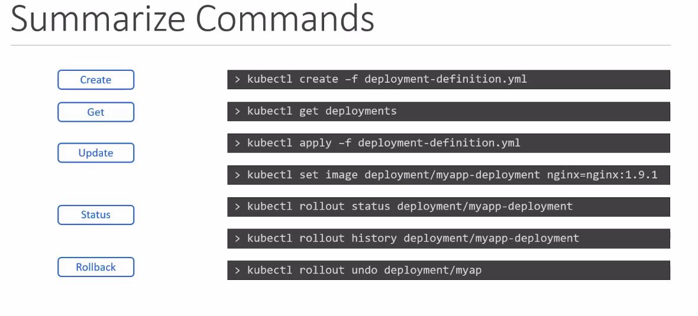

**Set new image**
```
kubectl set image <object> <name> <old image>=<new image>
```

**Commands**

```
apiVersion: v1
kind: Pod
metadata:
  creationTimestamp: null
  labels:
    run: ubuntu-spleeper-pod
  name: ubuntu-spleeper-pod
spec:
  containers:
  - command:
    - sleep
    args: ["10"]
    image: ubuntu
    name: ubuntu-spleeper-pod
    resources: {}
  dnsPolicy: ClusterFirst
  restartPolicy: Always
status: {}
```

**Configmap**

> https://kubernetes.io/docs/concepts/configuration/configmap/

__CLI__

```
kubectl create configmap cp-myapp --from-literal=DB_HOST=http://svc-db.default.svc.cluster.local --dry-run -o yaml
```

__YAML__

```
apiVersion: v1
data:
  DB_HOST: http://svc-db.default.svc.cluster.local
kind: ConfigMap
metadata:
  creationTimestamp: null
  name: cp-myapp
```

**Secrets**

> https://kubernetes.io/docs/concepts/configuration/secret/

__CLI__

```
kubectl create secret generic app-secrets --from-literal=DB_PASS=admin123 --dry-run -o yaml
```

__YAML__

```
apiVersion: v1
data:
  DB_PASS: YWRtaW4xMjM=
kind: Secret
metadata:
  creationTimestamp: null
  name: app-secrets
```

> Tips: to converte value secrets you can use `echo -n '<value>' | base64` the exist will be coding in base64


> Tips: A note about Secrets!
Remember that secrets encode data in base64 format. Anyone with the base64 encoded secret can easily decode it. As such the secrets can be considered as not very safe.

> The concept of safety of the Secrets is a bit confusing in Kubernetes. The kubernetes documentation page and a lot of blogs out there refer to secrets as a "safer option" to store sensitive data. They are safer than storing in plain text as they reduce the risk of accidentally exposing passwords and other sensitive data. In my opinion it's not the secret itself that is safe, it is the practices around it.

> Secrets are not encrypted, so it is not safer in that sense. However, some best practices around using secrets make it safer. As in best practices like:

> Not checking-in secret object definition files to source code repositories.
Enabling Encryption at Rest for Secrets so they are stored encrypted in ETCD.

> Also the way kubernetes handles secrets. Such as:
A secret is only sent to a node if a pod on that node requires it.
Kubelet stores the secret into a tmpfs so that the secret is not written to disk storage.
Once the Pod that depends on the secret is deleted, kubelet will delete its local copy of the secret data as well.
Read about the protections and risks of using secrets here

> Having said that, there are other better ways of handling sensitive data like passwords in Kubernetes, such as using tools like Helm Secrets, HashiCorp Vault. I hope to make a lecture on these in the future.


__Multi-container PODs Design Patterns__
There are 3 common patterns, when it comes to designing multi-container PODs. The first and what we just saw with the logging service example is known as a side car pattern. The others are the adapter and the ambassador pattern.

But these fall under the CKAD curriculum and are not required for the CKA exam. So we will be discuss these in more detail in the CKAD course.

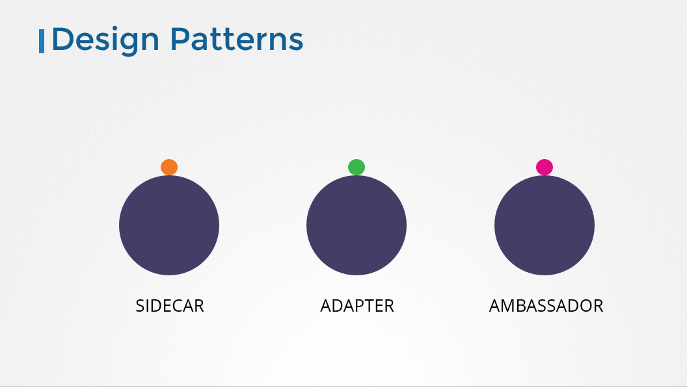

__InitContainers__
In a multi-container pod, each container is expected to run a process that stays alive as long as the POD's lifecycle. For example in the multi-container pod that we talked about earlier that has a web application and logging agent, both the containers are expected to stay alive at all times. The process running in the log agent container is expected to stay alive as long as the web application is running. If any of them fails, the POD restarts.

But at times you may want to run a process that runs to completion in a container. For example a process that pulls a code or binary from a repository that will be used by the main web application. That is a task that will be run only  one time when the pod is first created. Or a process that waits  for an external service or database to be up before the actual application starts. That's where initContainers comes in.

An initContainer is configured in a pod like all other containers, except that it is specified inside a initContainers section,  like this:

```
apiVersion: v1
kind: Pod
metadata:
  name: myapp-pod
  labels:
    app: myapp
spec:
  containers:
  - name: myapp-container
    image: busybox:1.28
    command: ['sh', '-c', 'echo The app is running! && sleep 3600']
  initContainers:
  - name: init-myservice
    image: busybox
    command: ['sh', '-c', 'git clone <some-repository-that-will-be-used-by-application> ; done;']
```

When a POD is first created the initContainer is run, and the process in the initContainer must run to a completion before the real container hosting the application starts.

You can configure multiple such initContainers as well, like how we did for multi-pod containers. In that case each init container is run one at a time in sequential order.

If any of the initContainers fail to complete, Kubernetes restarts the Pod repeatedly until the Init Container succeeds.

```
apiVersion: v1
kind: Pod
metadata:
  name: myapp-pod
  labels:
    app: myapp
spec:
  containers:
  - name: myapp-container
    image: busybox:1.28
    command: ['sh', '-c', 'echo The app is running! && sleep 3600']
  initContainers:
  - name: init-myservice
    image: busybox:1.28
    command: ['sh', '-c', 'until nslookup myservice; do echo waiting for myservice; sleep 2; done;']
  - name: init-mydb
    image: busybox:1.28
    command: ['sh', '-c', 'until nslookup mydb; do echo waiting for mydb; sleep 2; done;']
```

Read more about initContainers here. And try out the upcoming practice test.

> https://kubernetes.io/docs/concepts/workloads/pods/init-containers/


__Self Healing Applications__

Kubernetes supports self-healing applications through ReplicaSets and Replication Controllers. The replication controller helps in ensuring that a POD is re-created automatically when the application within the POD crashes. It helps in ensuring enough replicas of the application are running at all times.

Kubernetes provides additional support to check the health of applications running within PODs and take necessary actions through Liveness and Readiness Probes. However these are not required for the CKA exam and as such they are not covered here. These are topics for the Certified Kubernetes Application Developers (CKAD) exam and are covered in the CKAD course.

---

## Cluster Maintenance - `11%`

> https://kubernetes.io/docs/tasks/administer-cluster/cluster-management/

### Operation system upgrade

**Drain**

The given node will be marked unschedulable to prevent new pods from arriving. 'drain' evicts the pods if the APIServer
supportshttp://kubernetes.io/docs/admin/disruptions/ . Otherwise, it will use normal DELETE to delete the pods. The
'drain' evicts or deletes all pods except mirror pods (which cannot be deleted through the API server).  If there are
DaemonSet-managed pods, drain will not proceed without --ignore-daemonsets, and regardless it will not delete any
DaemonSet-managed pods, because those pods would be immediately replaced by the DaemonSet controller, which ignores
unschedulable markings.  If there are any pods that are neither mirror pods nor managed by ReplicationController,
ReplicaSet, DaemonSet, StatefulSet or Job, then drain will not delete any pods unless you use --force.  --force will
also allow deletion to proceed if the managing resource of one or more pods is missing.

```
kubectl drain <node name>
```

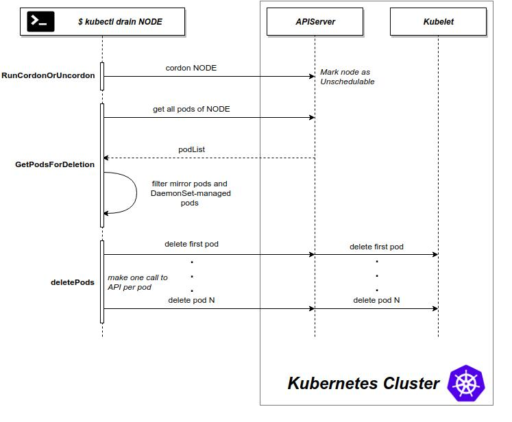

**Cordon**

Mark node as unschedulable, but not move any pod.

```
kubectl cordon <node name>
```


**Uncordon**

After you repair de node you can schedule pod again

```
kubectl uncordon <node name>
```

**Cluster upgrade**

1 - Upgrade de `kubeadm`
2 - Upgrade de node master

```
kubeadm upgrade apply <version>
```

3 - Upgrade `kubelet` too in your package manager and restart then
4 - Upgrade de nodes, upgrade the `kubeadm` and `kubelet`

```
kubeadm upgrade node --v=5
systemctl restart kubelet
```

**Backup and Restorage**

> https://kubernetes.io/docs/tasks/administer-cluster/configure-upgrade-etcd/#backing-up-an-etcd-cluster
https://github.com/etcd-io/etcd/blob/master/Documentation/op-guide/recovery.md
https://www.youtube.com/watch?v=qRPNuT080Hk


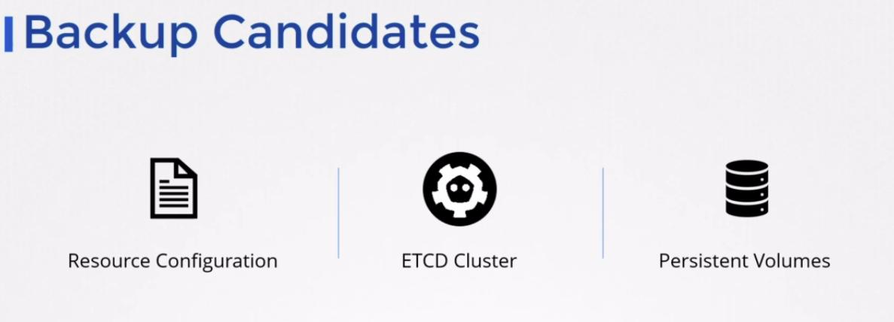

- Resource configuration, the backup can be doing by [`Velero`](https://velero.io/)
- ETCD backup and restore

__Backup__

```
ETCDCTL_API=3 etcdctl snapshot --endpoints=127.0.0.1:2379 --cacert=/etc/kubernetes/pki/etcd/ca.crt --key=/etc/kubernetes/pki/etcd/server.
key --cert=/etc/kubernetes/pki/etcd/server.crt save <file name>.db
```

__Restorage__

```
ETCDCTL_API=3 etcdctl snapshot restore
  --cacert=/etc/kubernetes/pki/etcd/server.crt
  --cert=/etc/kubernetes/pki/etcd/ca.crt
  --key=/etc/kubernetes/pki/etcd/ca.key
  --data-dir="/var/lib/etcd/etcd-from-backup"
  --initial-advertise-peer-urls="https://127.0.0.1:2380"
  --initial-cluster="master=https://127.0.0.1:2380"
  --name="master"
  --initial-cluster-token="etcd-cluster-1"
  <path backup file>.db
```

__Working with ETCDCTL__

`etcdctl` is a command line client for etcd.

In all our Kubernetes Hands-on labs, the ETCD key-value database is deployed as a static pod on the master. The version used is v3.
To make use of etcdctl for tasks such as back up and restore, make sure that you set the ETCDCTL_API to 3.
You can do this by exporting the variable ETCDCTL_API prior to using the etcdctl client. This can be done as follows:

export ETCDCTL_API=3

On the Master Node:

To see all the options for a specific sub-command, make use of the -h or --help flag.
For example, if you want to take a snapshot of etcd, use:
etcdctl snapshot save -h and keep a note of the mandatory global options.

Since our ETCD database is TLS-Enabled, the following options are mandatory:

--cacert                                                verify certificates of TLS-enabled secure servers using this CA bundle

--cert                                                    identify secure client using this TLS certificate file

--endpoints=[127.0.0.1:2379]          This is the default as ETCD is running on master node and exposed on localhost 2379.

--key                                                      identify secure client using this TLS key file


Similarly use the help option for snapshot restore to see all available options for restoring the backup.

```
etcdctl snapshot restore -h
```

For a detailed explanation on how to make use of the etcdctl command line tool and work with the -h flags, check out the solution video for the Backup and Restore Lab

---

# Security

## Security primitives

__Who can access ?__

- Files - Username and passwords
- Files - Username and Tokens
- Certificates
- External authentication providers LDAP
- Service accounts

__What can they do ?__

- RBAC authentication
- ABAC authentication
- Node authentication
- Webhook mode

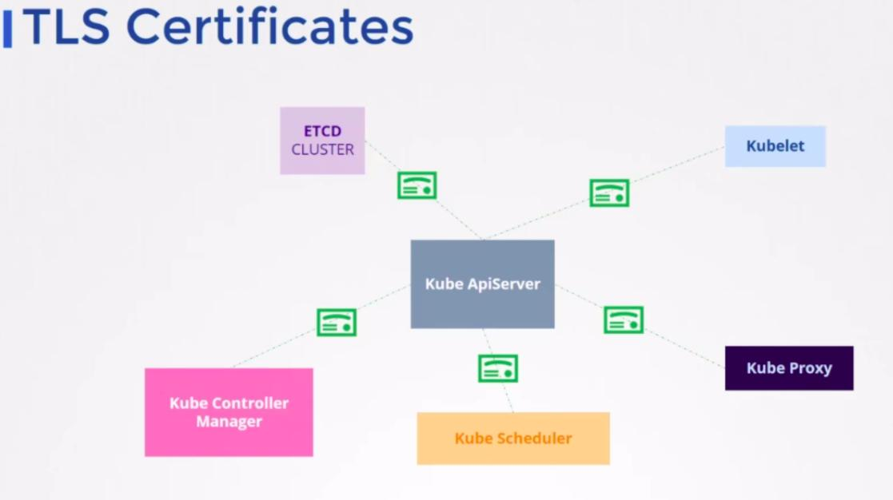

## Authenticate

**Users**

- Static password file

> https://kubernetes.io/docs/reference/access-authn-authz/authentication/#static-password-file

você pode passar uma lista de usuário e senha para a api, você deve edite o static pod e adicionar uma opção como parametro (password,name user, user id,group)

```
- --basic-auth-file=<file>.csv
```
__Validation__

```
curl -v -k http://master-node-ip:6443/api/v1/pods -u "user:password"
```

- Static Token file

> https://kubernetes.io/docs/reference/access-authn-authz/authentication/#static-token-file

você pode passar uma lista de usuário e token para a api, você deve edite o static pod e adicionar uma opção como parametro (token,name user, user id)

```
--token-autth-file=<file>.csv
```

__Validation__

```
curl -v -k https://master-node-ip:6444/api/v1/pods --header "Authorization: Bearer <token>"
```

#### Extra

Article on Setting up Basic Authentication
Setup basic authentication on kubernetes
Note: This is not recommended in a production environment. This is only for learning purposes.

Follow the below instructions to configure basic authentication in a kubeadm setup.

Create a file with user details locally at /tmp/users/user-details.csv

# User File Contents

```
password123,user1,u0001
password123,user2,u0002
password123,user3,u0003
password123,user4,u0004
password123,user5,u0005
```

Edit the kube-apiserver static pod configured by kubeadm to pass in the user details. The file is located at `/etc/kubernetes/manifests/kube-apiserver.yaml`

```
apiVersion: v1
kind: Pod
metadata:
  name: kube-apiserver
  namespace: kube-system
spec:
  containers:
  - command:
    - kube-apiserver
      <content-hidden>
    image: k8s.gcr.io/kube-apiserver-amd64:v1.11.3
    name: kube-apiserver
    volumeMounts:
    - mountPath: /tmp/users
      name: usr-details
      readOnly: true
  volumes:
  - hostPath:
      path: /tmp/users
      type: DirectoryOrCreate
    name: usr-details
```

Modify the kube-apiserver startup options to include the basic-auth file

```
apiVersion: v1
kind: Pod
metadata:
  creationTimestamp: null
  name: kube-apiserver
  namespace: kube-system
spec:
  containers:
  - command:
    - kube-apiserver
    - --authorization-mode=Node,RBAC
      <content-hidden>
    - --basic-auth-file=/tmp/users/user-details.csv
Create the necessary roles and role bindings for these users:
```

```
kind: Role
apiVersion: rbac.authorization.k8s.io/v1
metadata:
  namespace: default
  name: pod-reader
rules:
- apiGroups: [""] # "" indicates the core API group
  resources: ["pods"]
  verbs: ["get", "watch", "list"]
```

```
# This role binding allows "jane" to read pods in the "default" namespace.
kind: RoleBinding
apiVersion: rbac.authorization.k8s.io/v1
metadata:
  name: read-pods
  namespace: default
subjects:
- kind: User
  name: user1 # Name is case sensitive
  apiGroup: rbac.authorization.k8s.io
roleRef:
  kind: Role #this must be Role or ClusterRole
  name: pod-reader # this must match the name of the Role or ClusterRole you wish to bind to
  apiGroup: rbac.authorization.k8s.io
Once created, you may authenticate into the kube-api server using the users credentials

```

```
curl -v -k https://localhost:6443/api/v1/pods -u "user1:password123"
```

---

- Certificates
- Identy services


## TLS

> https://kubernetes.io/docs/tasks/tls/managing-tls-in-a-cluster/

- What are TLS certificates ?

São certificados validados por uma entidade certificadora, que valida a authentidade (CA - certificate authority), existem dois tipo sendo eles privado (*.pem) e publicos (*.key, *-key.pem), já os certificados possuem a extenção (*.crt).


- How does kubernetes use certificates ?

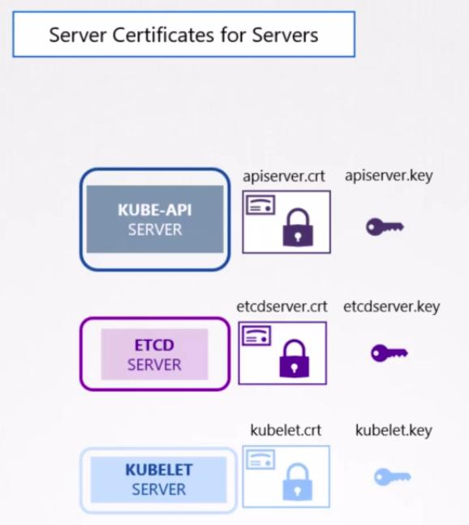

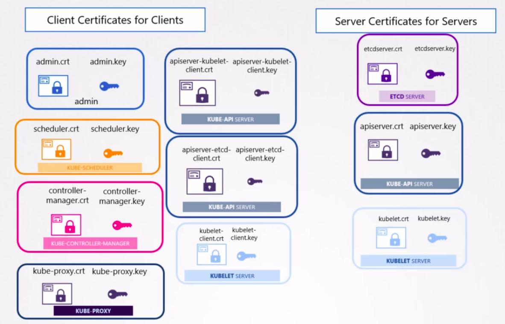

- How to generate them ?

Outras opções para se gerar certificados:

- Easyrsa
- CFSLL
- OpenSSL

#### OpenSSL (Client certificate for clients)

**Generate the private key**

```
openssl genrsa -out ca.key 2048
```

**Certificate signing request**

```
openssl req -new -key ca.key -subj "/CN=KUBERNETES-CA" -out ca.csr
```

**Sign certificates**

```
openssl x509 -req -in ca.csr -signkey ca.key -out ca.crt
```

##### Admin user

**Generate the private key**

```
openssl genrsa -out admin.key 2048
```

**Certificate signing request**

```
openssl req -new -key admin.key -subj "/CN=kube-admin" -out admin.csr
```

**Sign certificates**

```
openssl x509 -req -in admin.csr -CA ca.crt -CAkey ca.key -out admin.crt
```

**Validate**

```
curl https://kube-apiserver:6443/api/v1/pods --key admin.key --cert admin.crt --cacert ca.crt
```

- How to configure them ?

- How to view them ?

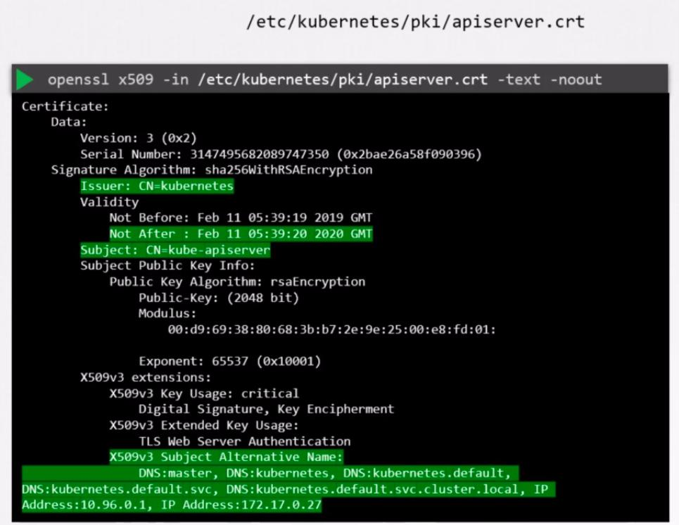

- How to troubleshooting issues related to certificates

__Show logs__

OS
```
jornalctl -u etcd.service -l
```

K8S

```
kubectl logs etcd-master
```

__Decode certificate__

```
openssl x509 -noout -text -in <certificate name>.crt
openssl x509 -noout -text -in /etc/kubernetes/pki/apiserver.crt

```
__Exercises get certificates info__

Certificate path | CN Name | ALT name | Organization | Issuer | Expiration
:---:|:---:|:---:|:---:|:---:|:---:|
`/etc/kubernetes/pki/apiserver.crt` | kube-apiserver | DNS:master, DNS:kubernetes,DNS:kubernetes.default,DNS:kubernetes.default.svc,IP Address:10.96.0.1,IP Address:172.17.0.27 |
`/etc/kubernetes/pki/apiserver.key` | - | |
`/etc/kubelet/pki/ca.crt` | Kubernetes | |
`/etc/kubernetes/pki/ca.crt` | kubernetes | |
`/etc/kubernetes/pki/apiserver-kubelet-client.crt` | kube-apiserver-kubelet-client | |
`/etc/kubernetes/pki/apiserver-kubelet-client.key` | - |
`/etc/kubernetes/pki/apiserver-etcd-client.crt` | kube-apiserver-etcd-client
`/etc/kubernetes/pki//etc/kubernetes/pki/apiserver-etcd-client.key` | - |
`/etc/kubernetes/pki/etcd/ca.crt` | kubernetes

```
openssl x509 -req -in /etc/kubernetes/pki/apiserver-etcd-client.csr -CA /etc/kubernetes/pki/etcd/ca.crt -CAkey /etc/kubernetes/pki/etcd/ca.key -CA
createserial -out /etc/kubernetes/pki/apiserver-etcd-client.crt
```

__Sign new certificate__

```
openssl x509 -req -in apiserver-etcd-client.csr -CA etcd/ca.crt -CAkey etcd/ca.key -CAcreateserial -out apiserver-etcd-client.crt
```

#### TLC certificate

> https://kubernetes.io/docs/concepts/cluster-administration/certificates/

```
openssl genrsa -out cesar.key 2048

openssl req -new -key cesar.key -subj "/CN=cesar" -out cesar.csr

```

__Create csr__

```
cat <<EOF | kubectl apply -f -
apiVersion: certificates.k8s.io/v1beta1
kind: CertificateSigningRequest
metadata:
  name: cesar
spec:
  request: $(cat cesar.csr | base64 | tr -d '\n')
  usages:
  - digital signature
  - key encipherment
  - server auth
EOF
```

__Approve or deny__
```
kubectl certificate approve

# OR

kubectl certificate deny
```

__Curl__

```
curl https://my-kube-playgraound:6443/api/v1/pods \
--key cesar.key \
--cert cesar.crt \
  --cacert ca.crt
```

### Kube-config

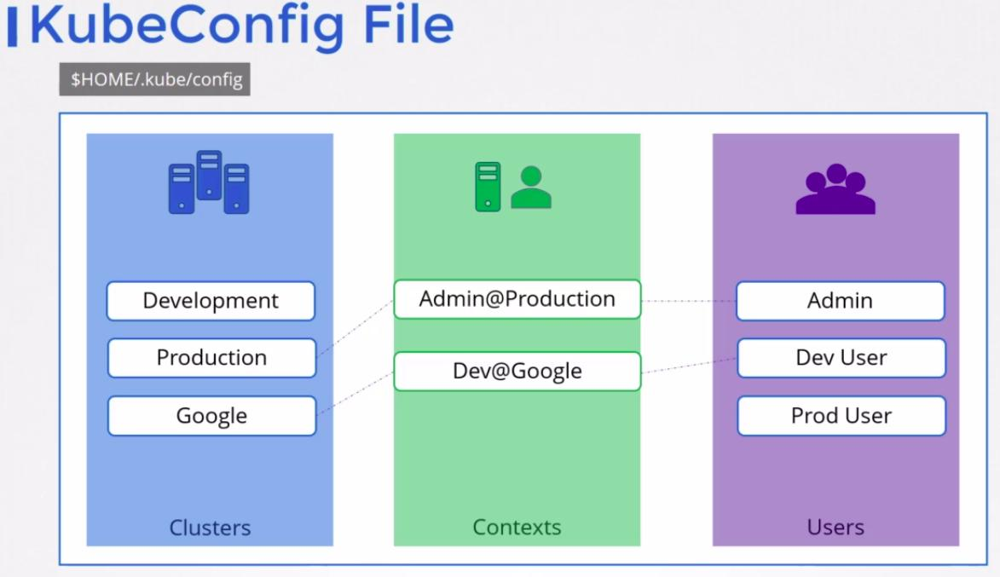

### API Groups

> https://kubernetes.io/docs/reference/access-authn-authz/rbac/
https://kubernetes.io/docs/reference/generated/kubernetes-api/v1.17/

__Get api groups available__

```
curl http://localhost:6443 -k
```

__Get resources groups__

```
curl http://localhost:6443/apis -k | grep "name"
```

__Connect to api__

```
curl http://localhost:6443 -k --key <user>.key --cert <user>.crt --cacert ca.crt
```
### RBAC

> https://kubernetes.io/docs/reference/access-authn-authz/rbac/

__Roles__

Is the group allow and deny, the user do something

```
apiVersion: rbac.authorization.k8s.io/v1
kind: Role
metadata:
  name: developer
rules:
- apiGroups: [""] # "" indicates the core API group
  resources: ["pods"]
  verbs: ["get", "watch", "list", "create"]
  resourceNames: ["default","developer"]
```

__RoleBinding__

```
apiVersion: rbac.authorization.k8s.io/v1
kind: RoleBinding
metadata:
  creationTimestamp: null
  name: rb-devs
roleRef:
  apiGroup: rbac.authorization.k8s.io
  kind: Role
  name: developer
subjects:
- kind: ServiceAccount
  name: dev1
  namespace: default
```

__Check if you can do something__

```
kubectl auth can-i <verb> <resource>
kubectl auth can-i <verb> <resource> --as <user>
```

__Clusterrole__

```
apiVersion: rbac.authorization.k8s.io/v1
kind: ClusterRole
metadata:
  # "namespace" omitted since ClusterRoles are not namespaced
  name: secret-reader
rules:
- apiGroups: [""]
  #
  # at the HTTP level, the name of the resource for accessing Secret
  # objects is "secrets"
  resources: ["secrets"]
  verbs: ["get", "watch", "list"]
```

__Clusterrolebinding__

> https://kubernetes.io/docs/reference/access-authn-authz/rbac/#clusterrolebinding-example

To grant permissions across a whole cluster, you can use a ClusterRoleBinding. The following ClusterRoleBinding allows any user in the group “manager” to read secrets in any namespace.

### Image Security

> https://kubernetes.io/docs/tasks/configure-pod-container/pull-image-private-registry/

```
kubectl create secret docker-registry <secret name> --docker-server=<registry-url> --docker-username=<username> --docker-password=<password> --docker-email=<email>
```

### Container security

> https://kubernetes.io/docs/tasks/configure-pod-container/security-context/

```
apiVersion: v1
kind: Pod
metadata:
  creationTimestamp: null
  labels:
    run: teste
  name: teste
spec:
  containers:
  - image: nginx
    name: teste
    securityContext:
      runAsUser: 0 # root
      capabilities:
        add: ["SYS_TIME"]
    resources: {}
  dnsPolicy: ClusterFirst
  restartPolicy: Always
status: {}
```

#### Network

> https://kubernetes.io/docs/concepts/services-networking/network-policies/


**Note**

Solutions that support network policies:

- kube-router
- Calico
- Romana
- Weave-net

Solutions that DO NOT support network policies:

- Flannel


// TODO: learning more about network policies

##### Setup minikube to network policies

__Calico__

```
minikube start --network-plugin=cni --enable-default-cni
kubectl apply -f https://docs.projectcalico.org/manifests/calico.yaml
```
__Lab policies__

Deployment nginx

```
kubectl create deployment nginx --image nginx
kubectl expose deployment nginx --name svc-nginx --port 80
```

Validate connection

```
kubectl run -ti --rm busybox --image busybox

wget --spider --timeout=1 svc-nginx
```

Apply the policies


__Deny all__

```
kind: NetworkPolicy
apiVersion: networking.k8s.io/v1
metadata:
  name: deny-access-nginx
spec:
  podSelector:
    matchLabels:
      app: nginx
  ingress: []
```

__Allow only label__

Only apps with this label `role=frontend` can make request to this app.

```
kind: NetworkPolicy
apiVersion: networking.k8s.io/v1
metadata:
  name: policy-frontend
spec:
  podSelector:
    matchLabels:
      app: nginx
  policyTypes:
    - Ingress
  ingress:
    - from:
      - podSelector:
          matchLabels:
            role: frontend
```

Add label on namespace, every on this namespace `role=frontend` can make request to the app or app with the label `role=frontend`

```
kind: NetworkPolicy
apiVersion: networking.k8s.io/v1
metadata:
  name: policy-frontend
spec:
  podSelector:
    matchLabels:
      app: nginx
  policyTypes:
    - Ingress
  ingress:
    - from:
      - podSelector:
          matchLabels:
            role: frontend
      - namespaceSelector:
          matchLabels:
            role: frontend
```

__Allow all traffic__

```
kind: NetworkPolicy
apiVersion: networking.k8s.io/v1
metadata:
  name: policy-frontend-allow-all
spec:
  podSelector:
    matchLabels:
      app: nginx
  policyTypes:
    - Ingress
  ingress: []
```

__Deny all traffic__

```
kind: NetworkPolicy
apiVersion: networking.k8s.io/v1
metadata:
  name: policy-frontend-deny-all
spec:
  podSelector: {}
  ingress: []
```

__Deny all traffic others namespaces__

```
kind: NetworkPolicy
apiVersion: networking.k8s.io/v1
metadata:
  name: policy-frontend-deny-other-ns
  namespace: default
spec:
  podSelector:
    matchLabels:
  ingress:
  - from:
    - podSelector: {}
```

Note a few things about this manifest:

- namespace: `default` deploys it to the `default` namespace.
- it applies the policy to ALL pods in `default` namespace as the spec.podSelector.matchLabels is empty and therefore selects all pods.
- it allows traffic from ALL pods in the `default` namespace, as spec.ingress.from.podSelector is empty and therefore selects all pods.

__Traffic only by port__

```
kind: NetworkPolicy
apiVersion: networking.k8s.io/v1
metadata:
  name: policy-frontend-port
spec:
  podSelector:
    matchLabels:
      app: nginx
  policyTypes:
    - Ingress
  ingress:
    - from:
      - podSelector:
          matchLabels:
            role: frontend
      ports:
        - port: 80
```

__Traffic multiple selectors__

```
kind: NetworkPolicy
apiVersion: networking.k8s.io/v1
metadata:
  name: policy-frontend-mult-selectors
spec:
  podSelector:
    matchLabels:
      app: nginx
  policyTypes:
    - Ingress
  ingress:
    - from:
      - podSelector:
          matchLabels:
            role: frontend
      - podSelector:
          matchLabels:
            role: teste
```

__Traffic multiple selectors and ports__

```
kind: NetworkPolicy
apiVersion: networking.k8s.io/v1
metadata:
  name: policy-frontend-mult-selectors-ports
spec:
  podSelector:
    matchLabels:
      app: nginx
  policyTypes:
    - Ingress
  ingress:
    - from: []
      ports:
        - port: 80
```

---

## Storage - `7%`

### Storage driver

- AUFS
- ZFS
- BTRFS
- Device mapper
- Overlay
- Overlay2


****************

## Minikube

**Metrics server**

```
minukube addons enable metrics-server
```

## Security - TLS certificate

> https://github.com/mmumshad/kubernetes-the-hard-way/tree/master/tools

## Kubernetes the hard way

> https://github.com/mmumshad/kubernetes-the-hard-way

---------

# Reference

- https://github.com/ahmetb/kubernetes-network-policy-recipes
- https://docs.projectcalico.org/reference/resources/networkpolicy
