# Certified Kubernetes Administrator

---
## Prerequisites:

- Linux operaton system
- TCP/IP base networking
- Fundamental concepts of containers

---

# Core Concepts - 19%

## Introduction and exploring kubernetes architecture

### What's Kubernetes ?
> https://kubernetes.io/docs/concepts/overview/what-is-kubernetes/

Kubernetes is a portable, extensible, **open-source platform for managing containerized workloads** and services, that facilitates both declarative **configuration and automation**. It has a large, rapidly growing ecosystem. Kubernetes services, support, and tools are widely available.

The name Kubernetes originates from Greek, meaning helmsman or pilot. Google open-sourced the Kubernetes project in 2014. Kubernetes combines over 15 years of Google’s experience running production workloads at scale with best-of-breed ideas and practices from the community.

**Resumo**

Kubernetes é um orquestrador de containers que nos permite realizar um gerenciamento de múltiplos ambiente separados por  workload (namespaces), abstraindo completamento a infraestrutura, de forma que não precisamos saber em qual host um pod está sendo executado, podemos também definir status através de configurações simples que podem ser via CLI, arquivos YAML ou Json.

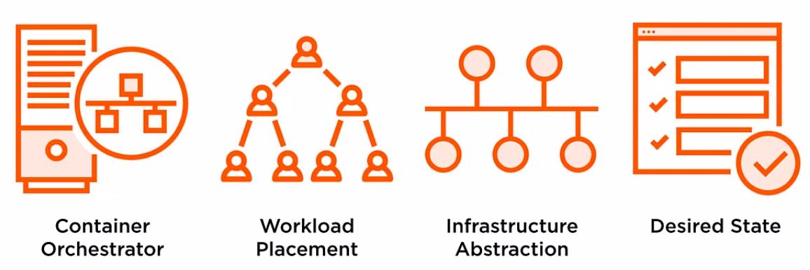

#### Benefits of using Kubernetes

Alguns benefícios de se utilizar Kubernetes:

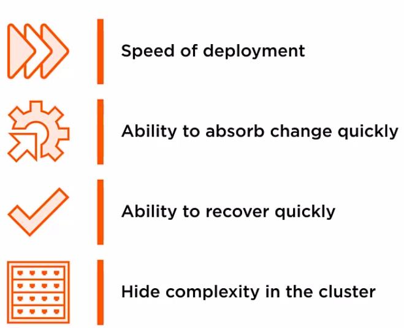

#### Principles

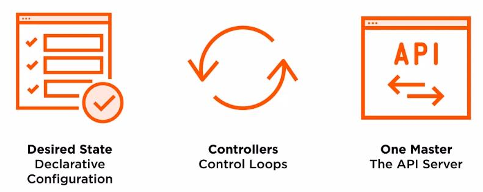

### Kubernetes API server

> https://kubernetes.io/docs/concepts/overview/kubernetes-api/
https://kubernetes.io/docs/reference/using-api/api-overview/
https://kubernetes.io/docs/concepts/overview/working-with-objects/kubernetes-objects/

The REST API is the fundamental fabric of Kubernetes. All operations and communications between components, and external user commands are REST API calls that the API Server handles. Consequently, everything in the Kubernetes platform is treated as an API object and has a corresponding entry in the API.

Most operations can be performed through the kubectl command-line interface or other command-line tools, such as kubeadm, which in turn use the API. However, you can also access the API directly using REST calls.

Resumo: Kubernetes possui uma **API** REST, que é responsável por toda a comunicação entre os componentes, podendo ser acessada via CLI ou remotamente

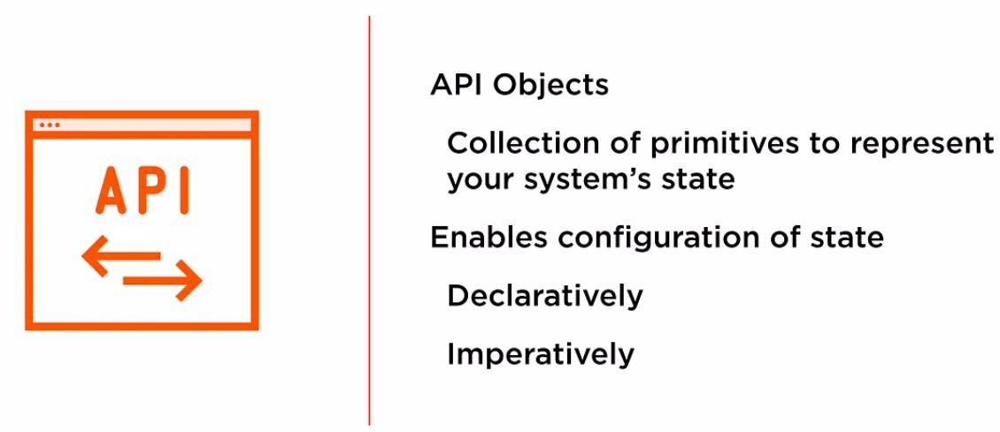

> https://kubernetes.io/docs/concepts/architecture/controller/
https://kubernetes.io/docs/concepts/workloads/pods/pod-overview/#understanding-pods
https://kubernetes.io/docs/concepts/workloads/controllers/replicationcontroller/
https://kubernetes.io/docs/concepts/#kubernetes-objects
https://kubernetes.io/docs/concepts/overview/working-with-objects/kubernetes-objects/#kubernetes-objects

Kubernetes contains a number of abstractions that represent the state of your system: deployed containerized applications and workloads, their associated network and disk resources, and other information about what your cluster is doing. These abstractions are represented by objects in the Kubernetes API.

- Pod
- Service
- Volume
- Namespace

Kubernetes also contains higher-level abstractions that rely on controllers to build upon the basic objects, and provide additional functionality and convenience features. These include:

- Deployment
- DaemonSet
- StatefulSet
- ReplicaSet
- Job

Resumo: Kubernetes possui basicamente quatro estruturas de objetos na api, sendo eles *pods*, *services*, *storage* e *Namespace*.

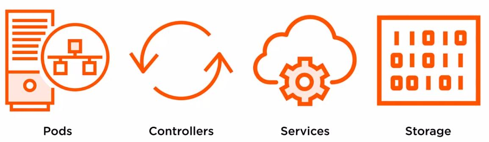

#### **[Pod](https://kubernetes.io/docs/concepts/workloads/pods/pod-overview/)**

É a menor unidade dentro do Kubernetes, eles podem armazenas um ou mais containers, ele é efemeral ou seja não armazena por si só nenhum dado do container.

- Pode ter um ou mais containers em um único pod
- Roda sua aplicação ou serviço
- Unidade mais básica do Kubernetes
- **Ephemeral** - não se pode realizar um `redeploy` de um `pod`.
- Atomicidade - ele existe ou não

O objetivo do Kubernetes é manter os `pods` **up** e **running**, mais especificamente manter os pods em seu estado desejado, **state** é o estado desejado do pod que normalmente é **Runnung**, porém para que seja possível ter esse state é preciso saber se a aplicação está funcionando corretamente, o **Health** é a saúde da sua aplicação que pode ser informada ao Kubernetes, dizendo quando existe algum problema ou não, esse monitoramento pode ser realizado através da feature `Liveness probes`, ele pode ser declarado nas configurações do seu `pod`.

#### **[Controllers ou control loop](https://kubernetes.io/docs/concepts/architecture/controller/)**

In Kubernetes, controllers are control loops that watch the state of your cluster, then make or request changes where needed. Each controller tries to move the current cluster state closer to the desired state.

Resumo: Controllers são responsáveis por criar e gerenciar os `pods`, são ele que verificam se o pod está em seu estado desejado, controla health state e realiza atualização de versão de necessário.

#### **[Replicaset](https://kubernetes.io/docs/concepts/workloads/controllers/replicaset/)**

A ReplicaSet’s purpose is to maintain a stable set of replica Pods running at any given time. As such, it is often used to guarantee the availability of a specified number of identical Pods.

Resumo: Controller responsável por garantir a quantidade de pods em execução está correta.

**When to use a ReplicaSet**

A ReplicaSet ensures that a specified number of pod replicas are running at any given time. However, a Deployment is a higher-level concept that manages ReplicaSets and provides declarative updates to Pods along with a lot of other useful features. Therefore, we recommend using Deployments instead of directly using ReplicaSets, unless you require custom update orchestration or don’t require updates at all.

This actually means that you may never need to manipulate ReplicaSet objects: use a Deployment instead, and define your application in the spec section.

#### **[Replicationcontroller](https://kubernetes.io/docs/concepts/workloads/controllers/replicationcontroller/)**

A ReplicationController ensures that a specified number of pod replicas are running at any one time. In other words, a ReplicationController makes sure that a pod or a homogeneous set of pods is always up and available.

**NOTE:** É um objeto que ainda existem mas está sendo subistituido pelo deployment.

#### **[Deployment](https://kubernetes.io/docs/concepts/workloads/controllers/deployment/)**

A Deployment provides declarative updates for Pods and ReplicaSets.

You describe a desired state in a Deployment, and the Deployment Controller changes the actual state to the desired state at a controlled rate. You can define Deployments to create new ReplicaSets, or to remove existing Deployments and adopt all their resources with new Deployments.

Resumo: Controller responsável pelo gerenciamento e controle de versão do `replicaset`, com ele podemos atualizar para um nova versão ou fazer um rollback de uma versão anterior.

**Use Case**

The following are typical use cases for Deployments:

- Create a Deployment to rollout a ReplicaSet. The ReplicaSet creates Pods in the background. Check the status of the rollout to see if it succeeds or not.
- Declare the new state of the Pods by updating the PodTemplateSpec of the Deployment. A new ReplicaSet is created and the Deployment manages moving the Pods from the old ReplicaSet to the new one at a controlled rate. Each new ReplicaSet updates the revision of the Deployment.
- Rollback to an earlier Deployment revision if the current state of the Deployment is not stable. Each rollback updates the revision of the Deployment.
- Scale up the Deployment to facilitate more load.
- Pause the Deployment to apply multiple fixes to its PodTemplateSpec and then resume it to start a new rollout.
- Use the status of the Deployment as an indicator that a rollout has stuck.
- Clean up older ReplicaSets that you don’t need anymore.

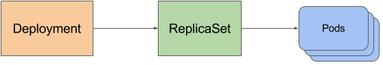

**[Statefulset](https://kubernetes.io/docs/concepts/workloads/controllers/statefulset/)**

StatefulSet is the workload API object used to manage stateful applications.

Manages the deployment and scaling of a set of Pods, and provides guarantees about the ordering and uniqueness of these Pods.

Like a Deployment, a StatefulSet manages Pods that are based on an identical container spec. Unlike a Deployment, a StatefulSet maintains a sticky identity for each of their Pods. These pods are created from the same spec, but are not interchangeable: each has a persistent identifier that it maintains across any rescheduling.

**Using StatefulSets**

StatefulSets are valuable for applications that require one or more of the following.

- Stable, unique network identifiers.
- Stable, persistent storage.
- Ordered, graceful deployment and scaling.
- Ordered, automated rolling updates.

**Note:** É uma forma de persistir dados em um pods de modo simples.

#### **[Daemonset](https://kubernetes.io/docs/concepts/workloads/controllers/daemonset/)**

A DaemonSet ensures that all (or some) Nodes run a copy of a Pod. As nodes are added to the cluster, Pods are added to them. As nodes are removed from the cluster, those Pods are garbage collected. Deleting a DaemonSet will clean up the Pods it created.

**Note:** É muito utilizado em monitoramento e coleta de informações.

#### **[Jobs - Run to Completion](https://kubernetes.io/docs/concepts/workloads/controllers/jobs-run-to-completion/)**

A Job creates one or more Pods and ensures that a specified number of them successfully terminate. As pods successfully complete, the Job tracks the successful completions. When a specified number of successful completions is reached, the task (ie, Job) is complete. Deleting a Job will clean up the Pods it created.

#### **[CronJob](https://kubernetes.io/docs/concepts/workloads/controllers/cron-jobs/)**

One CronJob object is like one line of a crontab (cron table) file. It runs a job periodically on a given schedule, written in Cron format.

**Note:** O crontab do kubernetes.

#### Outros

Existem outro tipo de controller, mas os sitados acima são os principais e mais utilizados.

- Garbage Collection
- TTL Controller for Finished Resources
- Jobs - Run to Completion

---

### **[Services](https://kubernetes.io/docs/concepts/services-networking/service/)**

An abstract way to expose an application running on a set of Pods as a network service.

With Kubernetes you don’t need to modify your application to use an unfamiliar service discovery mechanism. Kubernetes gives Pods their own IP addresses and a single DNS name for a set of Pods, and can load-balance across them.

Resumo: Services são uma abstração de rede para acesso os pods, ele é responsável por atualizar entregar e balancear requisições recebidas para os pods, sua estrategia de balanceamento padrão é "round robin".

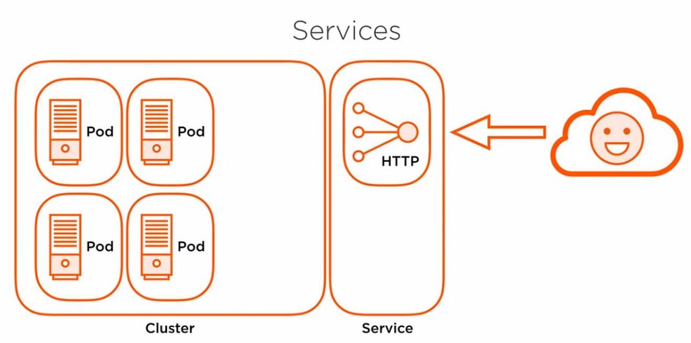

---

### [Storage](https://kubernetes.io/docs/concepts/storage/)

On-disk files in a Container are ephemeral, which presents some problems for non-trivial applications when running in Containers. First, when a Container crashes, kubelet will restart it, but the files will be lost - the Container starts with a clean state. Second, when running Containers together in a Pod it is often necessary to share files between those Containers. The Kubernetes Volume abstraction solves both of these problems.

Resumo: Kubernetes trabalha com o conceito de volume da mesma forma do Docker, você pode criar um volume físico em uma maquina ou utilizar um volume de uma cloud provider, para persistir dados do seus pods.

---

### **[kubernetes-control-plane](https://kubernetes.io/docs/concepts/#kubernetes-control-plane)**

The various parts of the Kubernetes Control Plane, such as the Kubernetes Master and kubelet processes, govern how Kubernetes communicates with your cluster. The Control Plane maintains a record of all of the Kubernetes Objects in the system, and runs continuous control loops to manage those objects’ state. At any given time, the Control Plane’s control loops will respond to changes in the cluster and work to make the actual state of all the objects in the system match the desired state that you provided.

For example, when you use the Kubernetes API to create a Deployment, you provide a new desired state for the system. The Kubernetes Control Plane records that object creation, and carries out your instructions by starting the required applications and scheduling them to cluster nodes–thus making the cluster’s actual state match the desired state.

**Master**

The Kubernetes Master is a collection of three processes that run on a single node in your cluster, which is designated as the master node. Those processes are: kube-apiserver, kube-controller-manager and kube-scheduler.

The Kubernetes master is responsible for maintaining the desired state for your cluster. When you interact with Kubernetes, such as by using the kubectl command-line interface, you’re communicating with your cluster’s Kubernetes master.

The “master” refers to a collection of processes managing the cluster state. Typically all these processes run on a single node in the cluster, and this node is also referred to as the master. The master can also be replicated for availability and redundancy.

#### Control plane components

O control plane é composto por basicamente quatro componentes, sendo eles:

- API server
- ETCD
- Controller manager
- scheduler

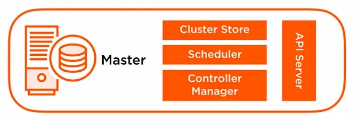

API Server | Cluster Store | scheduler | Controller manager
:---:|:---:|:---:|:---:|:---:
Central comunication | Persists configuration/change State | Watches API server | Controller loops
Simple | key-value | schedules Pods | Lifecycle functions and desired state
RESTful | ETCD | check resouces available | Watch and update the API Server
Updates ETCD | watch | Respects contraints |

###### [Kube API server](https://kubernetes.io/docs/concepts/overview/components/#kube-apiserver)

The API server is a component of the Kubernetes control plane that exposes the Kubernetes API. The API server is the front end for the Kubernetes control plane.

The main implementation of a Kubernetes API server is kube-apiserver. kube-apiserver is designed to scale horizontally—that is, it scales by deploying more instances. You can run several instances of kube-apiserver and balance traffic between those instances.

##### [Kube-controll-manager](https://kubernetes.io/docs/reference/command-line-tools-reference/kube-controller-manager/)

The Kubernetes controller manager is a daemon that embeds the core control loops shipped with Kubernetes. In applications of robotics and automation, a control loop is a non-terminating loop that regulates the state of the system. In Kubernetes, a controller is a control loop that watches the shared state of the cluster through the apiserver and makes changes attempting to move the current state towards the desired state. Examples of controllers that ship with Kubernetes today are the replication controller, endpoints controller, namespace controller, and serviceaccounts controller.

##### [Kube-scheduler](https://kubernetes.io/docs/concepts/overview/components/#kube-scheduler)

Control Plane component that runs controller processes.

Logically, each controller is a separate process, but to reduce complexity, they are all compiled into a single binary and run in a single process.

These controllers include:

- Node Controller: Responsible for noticing and responding when nodes go down.
- Replication Controller: Responsible for maintaining the correct number of pods for every replication controller object in the system.
- Endpoints Controller: Populates the Endpoints object (that is, joins Services & Pods).
- Service Account & Token Controllers: Create default accounts and API access tokens for new namespaces.

##### [Cluster Store - ETCD](https://kubernetes.io/docs/concepts/overview/components/#etcd)

Consistent and highly-available key value store used as Kubernetes’ backing store for all cluster data.

If your Kubernetes cluster uses etcd as its backing store, make sure you have a back up plan for those data

### [Node Components](https://kubernetes.io/docs/concepts/overview/components/#node-components)

The [nodes](https://kubernetes.io/docs/concepts/architecture/nodes/) in a cluster are the machines (VMs, physical servers, etc) that run your applications and cloud workflows. The Kubernetes master controls each node; you’ll rarely interact with nodes directly. Each node contains the services necessary to run pods and is managed by the master components. The services on a node include the `container runtime`, `kubelet` and `kube-proxy`.

**Note:** Esses três components `container runtime`, `kubelet` e `kube-proxy`, estão presentes em **TODOS OS NODES DO CLUSTER, INCLUINDO OS MASTER NDOES**

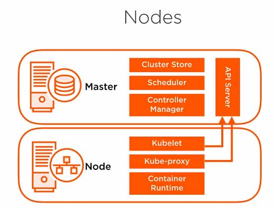

kubelet | Kube-proxy | Conteiner Runtime
:---:|:---:|:---:
Monitors API Server for changes | Network proxy iptables | Downloads images & runs containers
Responsible for Pod Lifecycle | Implements Service | Container Runtime Interface
Reports Node & Pod State | Routing traffic to Pods | Docker is default ?
Pod liveness probes | Load Balancing | [Docker](https://docs.docker.com/engine/), [ContainerD](https://containerd.io/docs/), [CRI-O](https://cri-o.io/#what-is-cri-o)

##### [Kubelet](https://kubernetes.io/docs/concepts/overview/components/#kubelet)

An agent that runs on each node in the cluster. It makes sure that containers are running in a Pod.

The kubelet takes a set of PodSpecs that are provided through various mechanisms and ensures that the containers described in those PodSpecs are running and healthy. The kubelet doesn’t manage containers which were not created by Kubernetes.

##### [Kube-proxy](https://kubernetes.io/docs/concepts/overview/components/#kube-proxy)

kube-proxy is a network proxy that runs on each node in your cluster, implementing part of the Kubernetes Service concept.

kube-proxy maintains network rules on nodes. These network rules allow network communication to your Pods from network sessions inside or outside of your cluster.

kube-proxy uses the operating system packet filtering layer if there is one and it’s available. Otherwise, kube-proxy forwards the traffic itself.

##### [Container runtime](https://kubernetes.io/docs/concepts/overview/components/#container-runtime)

The container runtime is the software that is responsible for running containers.

Kubernetes supports several container runtimes: Docker, containerd, CRI-O, and any implementation of the Kubernetes CRI (Container Runtime Interface).

##### Control plane and Nodes components

##### [Addons](https://kubernetes.io/docs/concepts/cluster-administration/addons/)

> https://kubernetes.io/docs/concepts/overview/components/#addons

Addons use Kubernetes resources (DaemonSet, Deployment, etc) to implement cluster features. Because these are providing cluster-level features, namespaced resources for addons belong within the kube-system namespace.

Selected addons are described below; for an extended list of available addons, please see Addons.

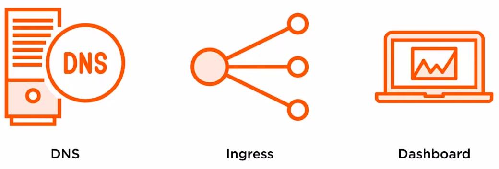

- [DNS](https://kubernetes.io/docs/concepts/overview/components/#dns)
- [Web UI](https://kubernetes.io/docs/concepts/overview/components/#web-ui-dashboard)
- [Container resource monitoring](https://kubernetes.io/docs/concepts/overview/components/#container-resource-monitoring)
- [Cluster level logging](https://kubernetes.io/docs/concepts/overview/components/#cluster-level-logging)

---

# Installation, Configuration & Validation - 12%

> https://jamesdefabia.github.io/docs/getting-started-guides/

**Consideration **

- Cluster networking
- Scalability
- Hight availability
- Disaster recovery

**Installation Methods**

- Desktop
- [Kubeadmin](https://kubernetes.io/docs/setup/production-environment/tools/kubeadm/create-cluster-kubeadm/)
- [Scratch](https://medium.com/@hashithkarunarathne/create-a-kubernetes-cluster-from-the-scratch-on-centos-7-rhel-7-and-deploy-an-application-on-85a92997b565)
- Cloud scenarios

**Requirements**
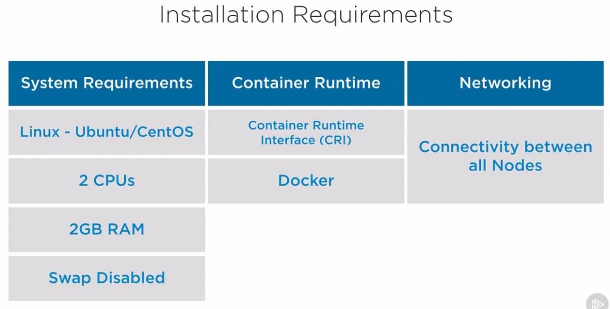

**Cluster networking**

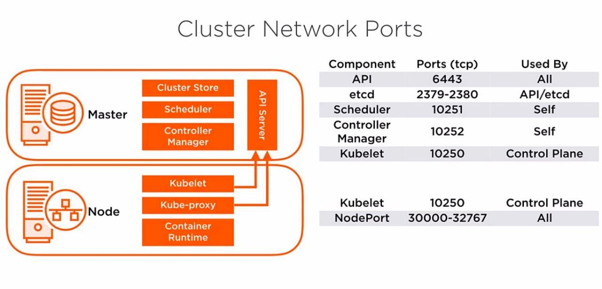
